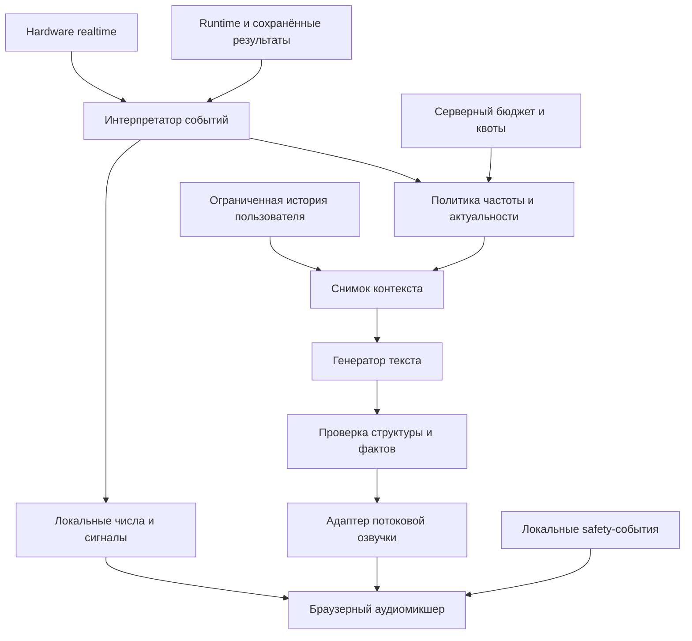

# Живой AI-тренер: продукт, сценарии, архитектура и стоимость

Дата: 07.10.2026. Статус: проектирование, версия 0.3.

**Реализация и текущий прогресс:**
[поэтапный план с чекбоксами](13-live-ai-coach-implementation.md).
Задачи, статусы этапов и доказательства проверок отмечаем в нём;
этот документ остаётся описанием требований и решений.

Основные решения и обзор — в этом документе.
Детальная спецификация поведения, событий, микшера, протокола и приёмки:
[13-live-ai-coach-spec.md](13-live-ai-coach-spec.md).
Численные defaults остаются предложениями до проверки на устройстве.

Подробные уточнения v0.3:
- [66 триггеров, плотность, сценарии и конкретные промпты](13-live-ai-coach-behavior-prompts.md).
- [Настройки, API key, мини-debug в хедере, подготовка фраз по клику и микшер](13-live-ai-coach-controls-audio.md).

Уточнения v0.3 имеют приоритет в своих областях над примерными параметрами v0.2.
Основные правила безопасности, фактов и бюджета не ослабляются.
Пользователь разрешил платные тесты; ключ намерен указать через настройки.
Платный запуск требует сохранённого server secret и ограниченного бюджета задания,
но не повторного вопроса разрешения для каждой попытки внутри согласованного задания.
В этой сессии выполнено только проектирование, без реальных inference requests.

Это план, а не описание готовой реализации. Изменения кода, платные запросы,
генерация пакетов и команды оборудованию в рамках подготовки документа не выполняются.
Численные настройки ниже — стартовые гипотезы для проверки, если явно не отмечены как решение пользователя.

## 1. Согласованные требования

| Область | Решение пользователя |
|---|---|
| Образ | Весёлый напарник + энергичный тренер, живой и интересный |
| Обращение | На «ты» |
| Язык и голос | Русский; выбор мужского и женского голоса |
| Разговорчивость | Часто общается, как живой напарник |
| Этапы | Во время упражнения, в паузах, после подходов, упражнений и тренировки |
| Отдых | Поддержка, юмор, разбор фактических повторений/темпа/нагрузки, сравнение с историей |
| Диалог | Только инициативная речь тренера; без микрофона |
| Память | Имя, стиль общения, результаты прошлых тренировок |
| Бюджет | До $2 API-расходов за тренировку |
| Быстрые фразы | Локальные записи, включая числа; уникальные реплики генерируются по ситуации |
| Микшер | Счёт и общение одновременно; последняя начавшаяся фраза громче, остальные приглушены |
| Прерывания | Обычные реплики не прерывают друг друга; безопасность — исключение |
| Частые фразы | Явная подготовка по кнопке: раздельно платная генерация и бесплатные download/decode |
| Диагностика | Мини-кнопка AI в общем и компактном хедере: requests/tokens/cost и причины отсутствия звука |
| Платные тесты | Разрешены; API key вводится в настройки и хранится только server-side |

Пользователь допускает подколы, ненормативную лексику и чёрный юмор.
Предлагается отдельный добровольный режим более резкого общения, выключенный по умолчанию.
Допустимость конкретного содержания ограничивается правилами провайдера и продукта:
без унижения, угроз, дискриминации, сексуализированного содержания и опасных советов.
Тёмная ирония относится к ситуации, не к боли, травмам, телу или личности пользователя.
Не обещаем, что модель будет воспроизводить любую запрошенную формулировку.

**Не уточнено:** считать каждое повторение или только ключевые. Ответ пользователя
определил микшер, но не частоту счёта. В проекте оставляем настройку:
«каждое / последние 3 / выключен»; default нужно согласовать.

## 2. Что делает тренера живым

Не поток случайных лозунгов, а ощущение одного напарника, который помнит происходящее:

1. Реагирует на конкретный момент: подход начался, выполнено 7 из 10, впереди последний подход.
2. Продолжает мысль между подходами, но не повторяет один и тот же совет.
3. Учитывает историю только тогда, когда сравнение действительно корректно.
4. Меняет энергию и интонацию: бодро на старте, коротко на усилии, разговорнее на отдыхе.
5. Использует имя умеренно, не в каждой реплике.
6. Чередует поддержку, юмор, наблюдение и короткий полезный комментарий.
7. Умеет молчать, когда не знает фактов, данные устарели или речь уже перегружает слушателя.
8. Не изображает зрение: положение грифа не доказывает правильное положение спины или суставов.

Один узнаваемый характер сохраняется у локальных клипов и сетевых реплик.
Мужской/женский голос — независимая настройка, а не разные правила безопасности.
Не следует искусственно добавлять вздохи, смех и междометия в каждую фразу.

### Речевая драматургия

- Старт тренировки: короткое приветствие, настрой на сегодняшний план.
- Первое упражнение: ориентир по задаче, без длинной лекции.
- Подход: счёт, мгновенная поддержка, редкие содержательные фразы между усилиями.
- Отдых: осмысленная реакция на сохранённый результат, иногда продолжение прежней шутки.
- Последний подход: ощущение финишного участка, без требования выйти за план.
- Итог: конкретный результат и позитивное завершение, без выдуманных рекордов.

## 3. Сценарии и плотность общения

«Часто» означает регулярное присутствие, но не непрерывный монолог.
Счёт не входит в лимит содержательных комментариев.

| Событие | Источник речи | Предлагаемая длина | Условие |
|---|---|---|---|
| Старт тренировки | LLM + озвучка | 8–15 с | Реальный план и выбранный пользователь |
| Подготовка упражнения | LLM + озвучка | 6–12 с | Загружены реальные метаданные |
| Начало подхода | Локальный клип | 0,5–2 с | Подход реально активен |
| Завершённое повторение | Локальное число | 0,3–1,2 с | Подтверждённое полное повторение |
| Ключевая отметка | Локальная вариативная поддержка | 1–3 с | Факт прогресса, cooldown |
| Ход подхода | LLM + озвучка | 3–6 с | Свежая telemetry, достаточно времени |
| Обычная пауза | Локально или молчание | 1–3 с | Пауза не приравнивается к завершению |
| Завершение подхода | Локальное объявление | 1–3 с | Честный статус: полный / частичный |
| Начало отдыха | LLM + озвучка | 8–15 с | Результат сохранён, отдых достаточно длинный |
| Длинный отдых | Дополнительная LLM-реплика | 5–10 с | Осталось время, нет повтора первой мысли |
| Конец отдыха | Локальный сигнал | 1–3 с | Таймер действительно идёт |
| Итог упражнения | LLM + озвучка | 8–15 с | Итоги уже рассчитаны приложением |
| Итог тренировки | LLM + озвучка | 15–25 с | Данные всех упражнений подтверждены |
| Боль / авария | Проверенный локальный сигнал | Кратко | Отмена обычной речи, без юмора |

Предлагаемый профиль «Напарник»:

- 1–3 содержательных комментария за обычный подход, интервал не менее 12–20 с;
- в коротком подходе допустимо 0–1, а не попытка вставить все запланированные реплики;
- 1–2 реплики на отдыхе 60–120 с, одна на коротком отдыхе;
- перед окончанием отдыха длинная реплика не начинается;
- target доли времени с содержательной речью: 20–35% активного подхода,
  25–45% отдыха; это гипотеза UX, не жёсткое требование пользователя;
- настройка «Тише / Напарник / Очень разговорчивый», отдельный выключатель счёта.

Речь после подхода и на отдыхе нужно объединять содержательно:
локальное «Подход завершён» + один содержательный комментарий, а не две сетевые
похвалы об одном результате. Итог последнего подхода может сразу вести к итогу упражнения.

### Примеры без выдуманных наблюдений

- 7 из 10: «Семь готово. Ещё три по плану — аккуратно, без гонки».
- Выполнено 10 из 10: «План закрыт. Десять повторений — десять аргументов в пользу отдыха».
- Выполнено 7 из 10: «Семь повторений сохранили. Давай восстановимся, без спектакля про обязательную десятку».
- Сравнимая история: «В прошлый раз с этим весом было девять, сегодня десять. Вот это уже конкретный прогресс».
- Истории нет: «Это первая сохранённая тренировка этого упражнения. Теперь будет с чем сравнить».

Это иллюстрации структуры, не конечный повторяемый словарь и не обязательная манера речи.

## 4. Источники фактов в текущем проекте

Проверка файлов на диске показала runtime, hardware и историю результатов.
Присутствуют приватные голосовые пакеты и следы прежнего coach-кода в bytecode.
Исходные coach-модули и каталог документации сейчас не найдены на диске.
Материалы редактора и прежние заметки не считаем доказательством текущей реализации.
Перед реализацией нужно решить, восстанавливаем ли прошлый код из доступной истории
или строим модуль заново. Старые клипы требуют аудита manifest, голоса и прав использования.

Подтверждённые точки интеграции:

- [Hardware runtime](../backend/app/services/hardware_runtime.py): положение грифа и сторон,
  скорость, направление, границы хода, полные/частичные повторения, режим управления,
  целевая и эффективная нагрузка. Публикация realtime предусмотрена отдельно от control loop.
- [Runtime service](../backend/app/services/runtime_service.py): фактические результаты подходов,
  план/факт, длительность, нагрузка, темп, амплитуда, субъективное усилие,
  дискомфорт и дополнительные machine metrics.
- [Frontend runtime store](../frontend/src/stores/runtime-store.ts): жизненный цикл UI-тренировки;
  `finishCurrentSet()` может временно выставить `completed`; это не доказательство полного результата.
- [Экран подхода](../frontend/src/screens/exercise-session/exercise-session-screen.tsx):
  обычное завершение вызывает hardware `complete_set`, сохраняет подход,
  на последнем подходе сохраняет итог упражнения и затем вызывает `finishCurrentSet()`.
  Тренеру нужны отдельные фактические события с сохранёнными ID, не только смена view.
- [Hardware types](../frontend/src/features/hardware/model/types.ts):
  `emittedAt`, `emulatorMode`, `control.mode`, `spotterActive`, `failureDetected`,
  длительности фаз. `repQuality` не доказывает правильную технику тела.

Тренер только читает эти данные. Не меняет алгоритм движения, нагрузку,
калибровку и правила завершения повторения. Счёт берётся из существующего
подтверждённого счётчика, не пересчитывается моделью по положениям грифа.

## 5. Архитектура: два контура и один микшер

### Быстрый контур

Локальные клипы: числа, начало, конец, последнее повторение, короткая поддержка,
проверенные сообщения остановки. Никакого API-вызова на каждое повторение.
Цель задержки event → start локального аудио: p95 < 100 мс после интерпретации события,
без обещания такого же SLA от физического движения до динамика.

### Разговорный контур

Событие → актуальный компактный контекст → текст → проверка → потоковое аудио.
Модель может выбрать молчание. Большинство бессмысленных поводов отсеивается до API.
LLM не определяет, наступила ли авария, завершился ли подход или выполнен ли рекорд.

Не отправляем 10–50 измерений/с в модель. На сервер попадают осмысленные события,
агрегаты и при необходимости обновлённый snapshot перед запуском речи.

### Размещение

- Frontend: интерпретатор UI/hardware, мгновенные клипы, микшер, настройки, диагностика.
- Backend: ключи, авторитетная история, генерация текста, voice adapter, бюджет, валидация.
- Hardware runtime: без ожидания сети, LLM и аудио; отказ тренера не влияет на движение.
- Один browser socket на активную тренировку; upstream-соединения управляются адаптером.
- Отдельные интерфейсы text/voice provider, чтобы сравнить модели без переписывания runtime.

## 6. Контекст и достоверность

Снимок содержит:

- ID пользователя, тренировки, упражнения, подхода, события и revision;
- тип упражнения из runtime: machine / bodyweight / timed / stretch / group;
- отдельно режим оборудования, включая isometric / fixed_hold, и единица прогресса reps / seconds;
- название, проверенное описание и подсказки каталога;
- фаза: setup / active / paused / rest / exercise-summary / workout-summary;
- текущий подход, сколько фактически сохранено и сколько запланировано;
- повторения или время: цель, фактическое значение, полные и частичные отдельно;
- фактическая нагрузка, режим, границы движения, положение/скорость/направление;
- агрегаты последних повторений, если метод расчёта определён;
- таймер отдыха и его состояние;
- safety: emergency, fault, stale telemetry, помощь, сообщённая боль;
- сравнимый прошлый результат, а не вся история пользователя;
- последние реплики/темы и ограничения стиля;
- разрешённые факты, максимальная длина и срок начала речи.

Каждый динамический факт имеет время, источник и валидность. Отсутствие — `null`, не ноль.
UI-plan не подменяет фактически применённую нагрузку оборудования.
Для немашинного упражнения положение грифа не используется как свидетельство действий пользователя.

### Что можно и нельзя заключать

| Данные | Можно | Нельзя |
|---|---|---|
| Подтверждённые повторения | «Выполнено семь» | «Каждое было технически идеальным» |
| Скорость грифа | «Последние движения медленнее» при валидном агрегате | «Ты достиг мышечного отказа» |
| Положение в диапазоне | Внутренняя отметка верх/низ | Оценка коленей, спины и положения тела |
| Нет движения | Учесть паузу и контекст | Автоматически считать застревание или требовать продолжать |
| Частичные повторения | Отдельный подтверждённый счёт | Объявить их полными |
| Сообщённая боль | Серьёзная короткая реакция | Диагноз или совет терпеть |
| Машинная амплитуда | Сравнить измеренный ход | Объявить физиологически правильный диапазон |

Сравнение истории: одинаковое упражнение, единицы, тип подхода, режим нагрузки,
сопоставимые границы движения и другие существенные параметры. Иначе явно
«условия отличаются» либо без сравнительной похвалы. Объём нагрузки не считается
универсальной метрикой для timed/bodyweight/isometric.
Рекорды, проценты и суммы рассчитывает приложение, не LLM.

## 7. Генерация текста и память

Предлагаемый основной генератор: `gpt-6-luna` через Responses API.
Модель получает короткую роль, стиль, allowedFacts и snapshot, возвращает структуру:

- `action`: speak / silence;
- `text`: одна законченная реплика;
- `intent`: motivation / humor / factual-feedback / general-tip / summary;
- `usedFactIds`: какие разрешённые факты использованы;
- `delivery`: энергия, темп, интонация из небольшого whitelist;
- `topicKey`: тема для защиты от повторов.

Поле usedFactIds помогает аудиту, но само по себе не доказывает истинность текста.
Нужны проверки чисел, запрет неподтверждённых утверждений и corpus-тесты.
При сомнении — безопасная неперсональная фраза или молчание, не дополнительные
циклы генерации ради любого ответа. Safety-фразы не генерируются свободно.

Предлагаемая память:

1. Профиль: имя и явно выбранный стиль.
2. Тренировка: короткое резюме, последние 6–10 содержательных реплик, использованные темы.
3. История: 1–3 сопоставимые прошлые тренировки нужного упражнения.

Не накапливать бесконечный transcript. Компактное резюме обновлять между подходами.
Не делать выводы о характере, диагнозах или эмоциях по темпу движения.
Метаданные каталога и пользовательские комментарии — данные, не инструкции модели.
Снижение разговорчивости доступно через UI, без микрофона.

### Защита от повторов

- Не повторять одну шутку внутри тренировки.
- Не повторять один совет несколько подходов подряд.
- Не называть имя чаще примерно одного раза в несколько содержательных реплик.
- Локальные клипы выбирать случайно без немедленного повтора.
- Во время усилия меньше сложных конструкций; на отдыхе допустимы 2–3 коротких предложения.
- Один комментарий — одна главная мысль.

## 8. Озвучка: сравнить три варианта

| Вариант | Преимущества | Риски |
|---|---|---|
| Luna → Realtime 2.1 mini | Выделенный генератор текста, выразительный потоковый голос | Два этапа задержки; Realtime не является строгим TTS |
| Luna → потоковый `gpt-4o-mini-tts` | Явное озвучивание входного текста, потоковый вывод, управление интонацией | Нужно оценить русский тембр и живость |
| Realtime 2.1 mini: текст и голос вместе | Один этап, потенциально быстрее | Сложнее проверить текст до начала звука и жёстко ограничить факты |

**Рабочая рекомендация:** сравнить первые два на одном наборе русских сценариев.
Не фиксировать Realtime только из-за слова «Realtime»: Speech API также поддерживает streaming.

Realtime — генеративный речевой собеседник, не гарантированно дословный диктор.
Если озвучивает текст Luna: короткая инструкция «произнеси только этот текст»,
изоляция контекста и проверка полученного transcript обязательны. Постфактум-проверка
не может отменить уже услышанное: для фактических/критичных фраз предпочтительнее
локальная запись или TTS. Если требуется строгая предварительная проверка всей речи,
буферизация увеличивает задержку и должна оцениваться отдельно.

Для Realtime без микрофона не нужна постоянная VAD-активность.
Не растить аудиоисторию всех прежних ответов без необходимости: она влияет на стоимость.
Проверить out-of-band responses или ограниченную историю по текущему API.

Локальные клипы и живой голос должны совпадать по тембру, темпу и громкости.
Одинаковое название stock voice у разных моделей не гарантирует одинаковое звучание.
Первоначально выбрать голоса по прослушиванию русского текста, а не по названию.
Пользователь должен знать, что голос синтетический.

### Сравнительный тест перед выбором

30 одинаковых сценариев для обоих кандидатов: числа, названия упражнений, нагрузки,
бодрая поддержка, спокойный итог, юмор, короткие сообщения и плохая сеть.

Оценить:

- живость, русское произношение, естественность, утомляемость;
- точность чисел и текста, соответствие голосов локальному пакету;
- p50/p95 event → первый слышимый звук, с учётом обоих этапов;
- фактические text/audio/cached/reasoning tokens, ошибки и оплаченные повторы;
- стоимость одинакового сценария, не «цена одного запроса»;
- качество при одновременном счёте.

Цель для короткого сетевого комментария: p95 первого звука ≤ 3 с на целевой сети.
Это критерий проверки, не заявленная характеристика моделей.
Платные тесты разрешены пользователем. Перед заданием фиксируются cap и выбранные
модели/голоса; новые packs и расширение cap не запускаются скрыто.

## 9. Микшер: точная спецификация

**Решение пользователя:** счёт и разговор идут одновременно и не прерывают друг друга.
Последняя действительно начавшая звучать фраза становится foreground.
Запрос к API, резервирование канала и ожидание PCM не меняют громкость текущей речи.

Предлагаемая реализация на Web Audio:

- общий AudioContext;
- отдельный источник и GainNode на каждую фразу;
- master gain, компрессор/лимитер и запас по пиковому уровню;
- нормализованные локальные и сетевые записи;
- плавный ducking за 40–80 мс, восстановление за 100–200 мс;
- foreground gain = 1 × пользовательская громкость;
- сумма gain фоновых голосов ≤ 0,65 × пользовательская громкость;
- при нескольких фоновых голосах бюджет делится между ними;
- по окончании foreground самым громким становится самый свежий оставшийся голос.

Коэффициенты gain не гарантируют отсутствие clipping: нужен контроль фактического master peak.
Счёт очередного повторения может на короткое время стать foreground, а комментарий
уйти в фон и восстановиться после числа. Громкость считаем по моменту playback start.

При трёх и более активных фразах новые необязательные сетевые комментарии временно
не запрашиваем; уже начавшиеся не обрываем. Числа и safety живут отдельно.
Не заказывать длинные реплики, которые неизбежно создают звуковую кашу.
Это ограничение новых запусков, не запрет пользовательского микширования.

Обычный переход подход → отдых → итог того же упражнения не обрывает начатую речь.
Новая фаза отменяет только устаревшие ещё не начавшиеся комментарии.
Смена пользователя/тренировки/упражнения, выключение тренера/звука,
скрытие вкладки и авария отменяют обычное аудио. Политику скрытой вкладки
можно изменить позже явно, если нужен фоновый режим.

Safety: все обычные источники останавливаются; при разрешённом звуке играет
проверенный сигнал остановки. Механическая защита никак не зависит от аудио.
Пауза таймера или обычная пауза грифа не считается аварией.

## 10. Сроки, отмена и защита от поздней речи

Событие содержит `eventId`, `scope`, `revision`, `createdAt`, `validUntil`,
`priority`, `phase`, `dedupKey` и snapshot источников.

- validUntil ограничивает **начало** речи, не обрывает уже начавшуюся обычную фразу.
- Перед API, после текста и перед первым звуком повторно проверить актуальность.
- События повторений имеют короткий срок; поздние числа выбрасываются, не копятся.
- Уже закрытый подход не получает поздний комментарий «ещё три».
- Сохранение результата, повторная telemetry, reconnect и возврат на экран не повторяют событие.
- Для ordinary речи один paid pipeline in flight по умолчанию;
  получение следующего аудио может идти во время проигрывания предыдущего.
- Долгий сбой не вызывает пачку запоздалых реплик после восстановления сети.
- Ограниченные очередь, число попыток, размер PCM и watchdog от первого звука.
- Остановка потока и его завершение подтверждаются протоколом, не только тишиной между пакетами.

Предложение: короткие cues 1–3 с на начало; during-set 3–5 с;
rest 10–20 с с учётом остатка; итог до 30 с. Значения проверяются на реальной сети.
Для уже начавшейся речи watchdog технический: 60 с, не продлевается пакетами;
нормальные реплики гораздо короче. Это новая проектная гипотеза, не legacy-настройка.

Скрытая вкладка, autoplay block, mute и недоступность AudioContext должны быть
видимыми причинами отсутствия звука. Активация AudioContext пользовательским жестом.

## 11. Локальный каталог и кеш

Минимальный пакет на каждый голос:

- числа 1–30; способ озвучивания выше 30 согласовать, без сетевого запроса на счёт;
- начало, конец, последний подход, полный/частичный итог;
- 10–20 коротких поддерживающих реплик с несколькими вариантами;
- подготовка и конец отдыха;
- проверенные сообщения безопасности.

Числа должны быть короткими, но естественными. Проверить их понятность
при быстром темпе и наложении на речь. Не создавать очередь запоздавших чисел.
Для timed/isometric вместо повторений — отдельные согласованные временные отметки.

Manifest: ID клипа, текст, язык, voice/model, стиль, версия, длительность, checksum.
Клипы preload/decode до подхода; аудиопакет приватный, генерация явная,
частичная загрузка не выдаётся за готовый пакет.

Кеш общей динамической речи возможен для неперсональных реплик:
ключ = нормализованный текст + голос + модель + язык + delivery + версия.
Не отдавать персональные фразы с именем и результатами через общий публичный кеш.
При пользовательском кеше — отдельное пространство, ограниченный срок и удаление.
Не подменять актуальный разбор случайной сохранённой похвалой.

Без сети: локальный счёт, старт/конец и вариативная поддержка остаются.
Сетевую речь не имитируем как реально сгенерированную. Ошибки модели не запускают
автоматически дорогой резервный provider без согласованной политики.

## 12. Экономика и лимит $2

Тарифы проверены по официальным страницам 07.10.2026.
Наличие в документации не гарантирует доступ конкретного аккаунта.
Перед реализацией и закупкой пакетов проверить актуальные цены повторно.

| Модель | Тип | Input / 1M | Cached input / 1M | Output / 1M |
|---|---|---:|---:|---:|
| gpt-6-luna | Text, Standard | $0.10 | $0.01 | $0.50 |
| gpt-realtime-2.1-mini | Text | $0.60 | $0.06 | $2.40 |
| gpt-realtime-2.1-mini | Audio | $10.00 | $0.30 | $20.00 |
| gpt-realtime-2.1 | Text | $4.00 | $0.40 | $24.00 |
| gpt-realtime-2.1 | Audio | $32.00 | $0.40 | $64.00 |

Источники:
[общие тарифы](https://openai.com/api/pricing/),
[подробная таблица](https://developers.openai.com/api/docs/pricing),
[Realtime](https://developers.openai.com/api/docs/guides/realtime),
[потоковый TTS](https://developers.openai.com/api/docs/guides/text-to-speech).
Цену TTS необходимо отдельно подтвердить по актуальной модели; в этом плане
не подставляется неподтверждённый тариф за минуту.

Стоимость:

$$
C_{workout} = C_{text} + C_{voice} + C_{paid\ retries} + C_{other\ billed\ usage}
$$

Для каждой модели считаем по фактическим непересекающимся категориям:

$$
C = \frac{T_{input,uncached}P_{input} + T_{input,cached}P_{cached} + T_{output}P_{output}}{10^6}
$$

Text и audio считаются отдельно по своим ставкам. Если provider input включает cached,
для формулы `input_uncached = input_total − input_cached`: cached оплачивается один раз
по cached-тарифу, остальное по обычному input-тарифу. Reasoning tokens учитываются согласно
фактической схеме usage провайдера, не поверх включающего их output.
Отменённые/неуслышанные ответы тоже могут быть платными.

### Иллюстративный бюджет, не обещание цены

Допущение для сравнения: 60 минут, 5 упражнений × 3 подхода,
около 70–90 уникальных реплик; реальная длительность тренировки ещё не уточнена.
Возьмём 80 запросов текста по 1500 input и 100 billable output tokens:
Luna = 120000 × $0.10 / 1M + 8000 × $0.50 / 1M = **$0.016** без cached скидки.

Если Realtime mini **фактически сообщит** за озвучку:
120000 text input, 8000 text output, 30000 audio output и нулевой audio input,
то голосовой этап = $0.072 + $0.0192 + $0.60 = **$0.6912**.
Вместе с Luna = **$0.7072** до повторов и дополнительной истории.
При том же наборе токенов полный Realtime 2.1 дал бы $2.592 только за voice stage.

Это условный набор usage, **не перевод минут в аудиотокены и не измерение**.
Настоящая цена может отличаться из-за аудиоконтекста, длины речи,
reasoning, тарифа аккаунта и ошибок. Требуется реальный сравнительный прогон.

### Управление бюджетом

- Единый серверный ledger по user + workout, а не новый бюджет при reconnect.
- Раздельно: текст, голос, повторные попытки, локальные/кешированные воспроизведения.
- UI: потрачено оценочно по usage, зарезервировано, остаток; неизвестные данные явно неизвестны.
- Перед платным запросом атомарно резервировать верхнюю оценку расходов.
- Ограничивать input/history/output/audio length и concurrency на сервере.
- При $1.50 уменьшать необязательные реплики; около $1.80 сохранять резерв на итог.
- Если запрос не помещается в остаток — локальный режим, не новый paid retry.
- При $2 платные запросы блокируются; локальная речь продолжает работать.
- Если provider не даёт надёжного верхнего предела тарификации,
  $2 — целевой лимит с запасом, не математически гарантированный cap;
  строгий cap требует доказуемой модели worst-case до отправки запроса.
- Разовая генерация пакетов оплачивается и согласуется отдельно от лимита тренировки.
- Не держать платный контекст/сессию активными без пользы; reconnect не теряет учёт.

## 13. UX и настройки

Первое включение: согласие на сетевую генерацию, объяснение передачи данных,
синтетического голоса и лимита. Микрофон не запрашивается.

Настройки на пользователя:

- включить тренера;
- мужской / женский голос с локальным preview;
- разговорчивость и счёт отдельно;
- юмор и резкость отдельно, более резкий режим явно opt-in;
- громкость; сила приглушения фоновых фраз — расширенная настройка;
- разрешить сравнение с историей;
- лимит расходов и локальный режим;
- субтитры или история последних реплик.

Субтитры полезны даже без отдельного text-only режима: шум в зале, проблемы
динамиков и диагностика. При нескольких голосах показывать счёт отдельно
от текста комментария. Не требовать чтения длинного текста во время усилия.

## 14. Приватность, безопасность и эксплуатация

- API key используется для provider calls только backend; сохранённый ключ
  не возвращается в браузер, не хранится там постоянно и не попадает в логи.
- Ввод key через transient password input настроек; до сохранения он неизбежно
  находится в DOM/памяти формы, но никогда не попадает в browser persist/экспорты.
  После save очищается; backend возвращает только configured/status. Для удалённого
  ввода HTTPS и operator auth обязательны, plaintext fallback в AppSetting запрещён.
- Минимум отправляемых данных; не отправлять полную историю и сырую telemetry.
- Имя и результаты передаются внешнему provider только после информированного включения.
- Память разделена по пользователям; переключение отменяет прежние задачи и аудио.
- Для сети за пределами доверенной LAN необходимы auth, rate limits и доступ к истории по владельцу.
- Хранение реплик и диагностик ограничено сроком; персональные тексты в логах по умолчанию выключены.
- Удаление coach-памяти и персонального кеша без удаления истории тренировок.
- Боль, fault и emergency обрабатываются детерминированно; защитная логика остаётся автономной.
- Тренер не назначает лечение, не требует терпеть боль, не добавляет вес/повторения самостоятельно.
- При плохих данных лучше нейтральная поддержка или молчание, чем убедительная выдумка.

## 15. Проверки и критерии готовности

### Без paid API и движения оборудования

- Recorded/replayed telemetry + fake providers для всех фаз.
- Полные, частичные, пропущенные подходы и сохранение результата с задержкой.
- Реальная пауза ≠ отдых; timed и isometric ≠ обычный счёт повторений.
- stale snapshot, fault, боль, смена пользователя, reconnect, hidden tab, mute.
- Отмена между текстом и голосом, поздний PCM, дубликаты событий.
- Микшер: две/три фразы, duck только на start, восстановление громкости, отсутствие clipping.
- Обычные переходы не обрывают начатые голоса; safety отменяет все обычные источники.
- Бюджет не сбрасывается и не удваивается после reconnect; unknown usage не считается нулём.
- Никаких вызовов motor API из тренера, отсутствие влияние сети на control loop.

### После ограниченного платного теста

- Русское произношение и тембр обоих голосов прослушаны человеком.
- Короткие local cues p95 < 100 мс после события на целевом устройстве.
- Network first-audio p95 измерен и соответствует выбранному UX-бюджету.
- Контрольная тренировка не превышает согласованный лимит с учётом retry.
- Ноль выдуманных результатов/рекордов/наблюдений в контрольном наборе.
- Ноль устаревших чисел и реплик после закрытия их scope.
- По оценке пользователя: естественно, интересно, счёт различим, наложение не утомляет.
- Playback started в логах — не доказательство физической слышимости динамиков;
  финальная проверка обязательно включает прослушивание.

## 16. Этапы реализации

1. **Аудит и контракт.** Проверить доступность прежних исходников, существующие пакеты,
   события runtime и источник фактической нагрузки. Утвердить schemas и recording fixtures.
2. **Локальный тренер и микшер.** Счёт, start/end, safety, пользовательские настройки,
   autoplay unlock, одновременные фразы, диагностика. Работает без сети.
3. **Генератор текста.** Luna, контекст, анти-повторы, структурированные решения,
   история и проверки фактов; сначала fake voice.
4. **Сравнение озвучки.** Два voice adapter, одинаковый оплаченный A/B-набор,
   выбор по русской живости, задержке, цене и точности.
5. **Вся тренировка.** Подход, пауза, отдых, итог упражнения и тренировки;
   частый профиль и драматургия без дублирования.
6. **Учёт бюджета и эксплуатация.** Серверный ledger, резервирование,
   деградация, приватность, удаление памяти и ограничение логов.
7. **Приёмка.** Replay-тесты, проверка звука на устройстве, контрольная тренировка,
   коррекция частоты/длины/ducking по впечатлениям пользователя.

## 17. Следующие решения

- Частота счёта по умолчанию: каждый / последние 3 / выключен?
- Типичная тренировка: длительность, упражнения, подходы, длина отдыха?
- Пауза пользователя: молчать или один раз коротко поддержать? Не путать с аварией.
- Давать ли общий совет по упражнению на отдыхе или пока только юмор и анализ результатов?
- Конкретные мужской/женский тембры: выбираем по русскому прослушиванию.
- Насколько частый профиль комфортен при счёте каждого повторения?
- Нужно ли начать с восстановления прежнего модуля, если исходники доступны?
- Принимаем ли предложенный добровольный режим резкого общения и его границы?

Открытые вопросы не мешают проектированию: детальная спецификация предлагает безопасные
настраиваемые defaults и критерии проверки, не выдавая их за ответы пользователя.
Перед реализацией согласуем эти defaults и выбор voice provider.