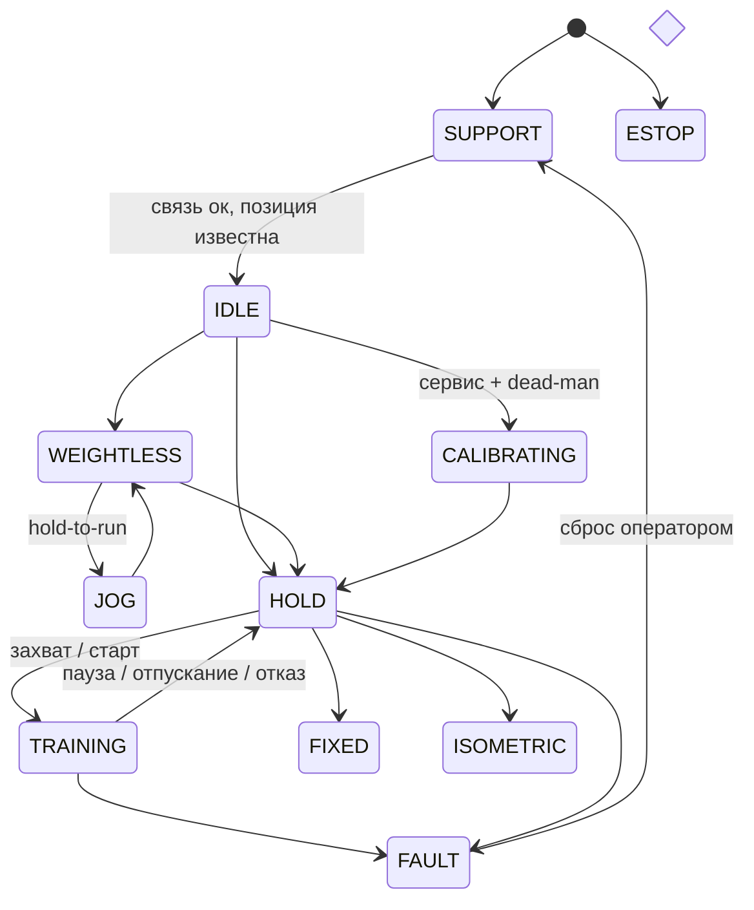
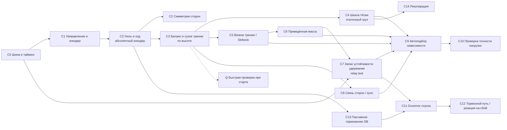

# 14. Управление двигателями v2: нагрузка, автокалибровки, автотесты

> Статус: **проект (design), код не менялся.** Документ описывает, как сейчас
> устроено управление приводами, почему его стоит снести, и как построить новое
> управление двигателями и нагрузкой с упором на автоматические калибровки и
> большой набор тестов, которые сами подбирают и проверяют параметры.

---

## 0. Короткое резюме

* Сейчас управление — это один монолит `MotionController` (1523 строки), поверх
  которого `TorqueController` повторно реализует регуляторы позиции/скорости
  через PA_12C. Внутри используются три разные шкалы силы
  (`perKgRaw`, `weightCompensationRaw`, `kgToTorqueFactor`). Параметров 152,
  12 из них нигде не читаются, ещё около 20 не имеют смысла на реальном железе.
* Калибровки (`procedures.py`) написаны под эмулятор. Они опираются на режимы
  удержания и перемещения, которые на реальном Modbus-приводе нестабильны.
  Нет предусловий, метрик качества, проверки после применения и истории.
* Эмулятор моделирует **другую машину**: у него есть идеальный механический
  тормоз, внутренние контуры позиции и скорости в «драйвере», нет задержки шины,
  квантования PA_12C и реального поведения PA_056. Поэтому тесты проходят на
  эмуляторе, а на железе удержание раскачивается.
* Предложение: новый стек `motor/` с одной системой единиц, чистым
  детерминированным ядром и цифровым двойником. Двойник повторяет реальный
  тракт (задержки, квантование, сухое трение, лимиты драйвера). Калибровки
  строятся как граф процедур идентификации с метриками качества и
  верификацией. Тесты используют двойник со **случайными, но известными**
  физическими параметрами: калибровка должна их восстановить, автотюнер —
  подобрать устойчивые настройки. Получаются сотни–тысячи проверяемых
  комбинаций.
* Тренажёр сейчас не используется, поэтому замена **сразу**: старый стек
  удаляется первым этапом, на время разработки остаётся минимальный
  безопасный runtime (поддержка + debug). Требования безопасности из
  старых тестов переносятся в новые до удаления (§10).

---

## 1. Как устроено сейчас (инвентаризация)

### 1.1 Файлы

| Слой | Файл | Строк | Что делает |
|---|---|---:|---|
| Цикл | `backend/app/services/hardware_runtime.py` | 1760 | asyncio-цикл 20 мс, `_tick_motion` в `to_thread`, процедуры, jog, панель, снапшоты, записи, параметры |
| Команды API | `backend/app/services/hardware_service.py` | 904 | диспетчер `action` → методы runtime, tuning/presets/calibrations |
| Логика | `backend/app/services/motion/controller.py` | 1523 | 13 режимов, homing (11 фаз), нагрузки, повторы, спотер, синхронизация, оценка усилия, безопасность, генерация команд |
| Момент | `backend/app/services/motion/torque.py` | 247 | kg → PA_12C: вес, PD для position/velocity, ramp, overspeed, soft limits, sync, инверсия, clamp |
| I/O | `backend/app/services/motion/modbus_adapter.py` | 384 | чтение 14 регистров на сторону, запись PA_12C, резервный момент 100, latch |
| Шина | `backend/app/services/modbus_service.py` | 1073 | RS-485, `_lock`, stale drain, torque API, debug API, симуляция регистров |
| Параметры | `backend/app/services/motion/parameters.py` | 403 | 152 параметра в 13 группах, валидация, persisted/temporary |
| Калибровки | `backend/app/services/motion/procedures.py` | 355 | 5 измерений + 7 сценариев (генераторы по тикам) |
| Эмулятор | `backend/app/services/motion/emulator.py` | 433 | физика 1 мс, виртуальная рука, инъекция сбоев |
| Контракт | `backend/app/services/motion/adapter.py` | 120 | `SideCommand` (mode brake/torque/velocity/position, kg), телеметрия |
| UI | `frontend/src/screens/mechanics-tuning/**` | ~1700 | параметры, live, процедуры, пресеты, записи, эмулятор |
| UI debug | `frontend/src/screens/modbus-debug/**` | ~2700 | регистры, режимы, DI/DO, лог |

Тесты бэкенда по железу: `test_stage12_motion_control.py` (30),
`test_motion_backup_torque.py` (19), `test_modbus_torque_runtime.py` (18),
`test_stage8_hardware_api.py` (12), `test_modbus_two_drives.py` (9) — всего
**88 тестов**. В основном это регрессии на конкретные инциденты.

### 1.2 Поток данных за один тик

```mermaid
flowchart LR
  A[HardwareRuntime._tick_motion<br/>dt = 0.02 номинально] --> B[merge panel sensors<br/>auto-zero]
  B --> C[MotionController.tick<br/>13 режимов]
  C -->|SideCommand kg:<br/>torque / velocity / position / brake| D[rate limit<br/>safety.torqueRateLimit]
  D --> E[ModbusDriveAdapter.step]
  E --> F[read 0x1BC×14 L, R]
  F --> G[TorqueController.compute<br/>weightRaw + (F−W)·perKgRaw<br/>или PD kp·holdGain / kv]
  G --> H[ramp rampStepRaw → overspeed → soft limits<br/>→ sync → inversion → clamp maxCommandRaw]
  H --> I[write PA_12C<br/>deadband 3, refresh 0.25 c]
  E -->|brake/idle/fault/estop| J[PA_12C = ±100 support]
```

### 1.3 Режимы контроллера

`idle, post, homing, moving, weightless, start_hold, training, fixed_hold,
isometric, paused, parked, estop, fault` + многофазный homing по концевикам. Нагрузка задаётся через
`load_mode` (`normal_weight, assist_up, negative_phase, light_mode, isokinetic,
bodyweight, no_machine, fixed_position, isometric`).

Сила на сторону в `training`:

```
F = gravity + friction(v) + inertia(a) − load·direction·curve·slow·levitation/2
    + descentBrake + softBumper + sync
```

---

## 2. Диагноз: почему это трудно настраивать

### 2.1 Три шкалы силы и замкнутый круг измерений

* В `TorqueSettings._weight_raw` вес берётся из `torque.weightCompensationRaw` и
  масштабируется на `(barMass + movingParts)/2`. Если это значение 0, вес
  считается через `perKgRaw`. Нагрузка всегда идёт через `perKgRaw`, но в
  контроллере её ещё умножают на `load.kgToTorqueFactor`. Получаются **три
  независимых коэффициента** для одной физической величины «Н на единицу
  PA_12C».
* Телеметрия силы — это `feedback_torque_raw / perKgRaw`. Оценщик усилия
  пользователя считает `mass − drives`. Если `weightCompensationRaw` не равен
  `mass/2·perKgRaw`, в покое появляется **фантомное усилие пользователя**. Из-за
  него ложно срабатывают захват, отпускание и отказ.
* `measure_bar_mass` измеряет массу в единицах, заданных тем же `perKgRaw`. Это
  замкнутый круг: абсолютную шкалу так получить нельзя.
* `profile.*.torqueLimitPercent` — это % от `(load.maxKg + bar)/2`, а не от
  номинала привода.

### 2.2 Регуляторы поверх регуляторов

* Контроллер выдаёт `velocity`/`position`-команды так, будто их исполняет
  драйвер. Эмулятор так и делает: `drive_kp = 3 кг/мм`, `drive_kv = 0.2`,
  подшаг 1 мс.
* На железе их исполняет `TorqueController` по Modbus с задержкой 1–3 тика:
  `kp = 2.0 · holdGainFactor 0.25 = 0.5 кг/мм` на сторону. По прошлым
  инцидентам устойчиво только около 0.05 кг/мм. Отсюда раскачка удержания
  после «Спасения» и паузы.
* В режиме `torque` `TorqueController` **игнорирует** `force_limit_kg`, а
  эмулятор его соблюдает. Значит, `profile.training.torqueLimitPercent` на
  железе ничего не ограничивает, остаётся только `maxCommandRaw`.

### 2.3 Дубли и противоречия

| Тема | Где дублируется |
|---|---|
| Синхронизация | `sync.correctionGain`/`correctionMaxMmPerSec` (контроллер, torque-команды) и `torque.syncGainRawPerMm`/`syncMaxRaw` (TorqueController, position/velocity) |
| Ограничение скорости роста момента | `safety.torqueRateLimitPercentPerSec` (контроллер, кг) и `torque.rampStepRaw` (raw/тик, зависит от реального dt) |
| Скорость | `limits.maxSpeedMmPerSec`, `limits.maxDescentSpeedMmPerSec`, `limits.maxUserSpeedMmPerSec`, `detection.failureDescentSpeedMmPerSec`, `torque.speedLimitRpm/WarnRpm/AlarmRpm` — 7 порогов в двух единицах |
| Шкала энкодера | параметр `screw.mmPerPulse` не используется: в `modbus_service.py` захардкожено `_MM_PER_PULSE` |
| Время | адаптер считает скорость по разности позиций с реальным временем, контроллер фильтрует и дифференцирует её с номинальным `dt` тика |

### 2.4 Мёртвые и бессмысленные на железе параметры

* **Не читаются нигде (12):** `start.confirmCountdownSec`, `load.rampOutSec`,
  `load.forceSource`, `safety.commTimeoutMs`, `safety.commRetryCount`,
  `safety.idleTimeoutMin`, `screw.pitchMmPerRev`, `screw.gearRatio`,
  `screw.travelLengthMm`, `screw.encoderDriftAlarmMm`, `screw.mmPerPulse`,
  `fixed.gripHeightMarginMm`.
* **Есть в коде, но на Torque-Mode железе фиктивны:** `profile.*.jerkMmPerSec3`
  (6 шт.), `compensation.backlashMm` (только «предлагается» процедурой),
  `sync.mode=master_slave`, `safety.heartbeatTimeoutMs` (только эмулятор),
  весь блок `homing.*` с концевиками (17 шт.), когда концевиков нет,
  `start.holdTorquePercent`, `fixed.torquePercent` (% от «ёмкости»).

### 2.5 Калибровки

| Процедура | Проблема |
|---|---|
| `bar_mass` | `request_hold` → PD по Modbus; сила = feedback/perKgRaw → результат в «своих» единицах |
| `friction` | ходит через `velocity`-режим, в силе сидит вклад регулятора; есть спуск, который на железе ненадёжен |
| `inertia` | ускорение = Δ(фильтрованной v)/номинальный тик → шум; профиль `training` 800 мм/с — опасно на железе |
| `backlash` | интеграл скорости минус путь; в torque-mode люфт так не наблюдается |
| `kg_factor` | работает **только** с виртуальной рукой эмулятора |
| `failure`, `jerk` | только эмулятор |
| все | нет предусловий (температура, связь, неподвижность), нет повторяемости, R², доверительных интервалов, проверки после применения и истории; порядок зависимостей (трение ← масса ← шкала) не соблюдается; «suggested» применяется вручную |

### 2.6 Физика машины, которую надо учитывать (из прошлых замеров)

* Шина: RS-485 115200 8E1, два драйвера (ID1 левый, ID2 правый), на тик
  2 чтения по 14 регистров + 2 записи + межслейвовая пауза 10 мс. Реальный
  период цикла заметно больше 20 мс, задержка управления 1–3 тика.
* На сторону: вес около 10–13 кг. **Сухое трение около 5 кг на сторону**
  (около 50 % веса). Равновесие около 94–98 raw. Около 125 raw — залипание.
* Шкала силы и энкодера выводятся из паспорта (см. §2.8).
* PA_056 (лимит скорости) **не тормозит** опускание под действием веса:
  на железе автоматический спуск разгонялся до ~151 мм/с.
* Механического тормоза нет. Резервный PA_12C = 100 — не регулятор и не
  страховка.
* Датчика силы нет и **не будет** (решение). Усилие пользователя
  оценивается только по модели (§4.5). Ниже уровня сухого трения
  (~10 кг на гриф) в покое оно **ненаблюдаемо**.

### 2.8 Паспорт железа и что из него следует

| Узел | Модель | Расшифровка (сверить с шильдиком и мануалом) |
|---|---|---|
| Мотор | Lichuan **LCMT-10LR17NB-90M04025B** | 1.0 кВт, фланец 90, **T_rated = 4.0 Н·м**, 2500 об/мин (самопроверка: 4.0·2500·2π/60 ≈ 1047 Вт), энкодер 17 бит (R17). T_max обычно 3·T_rated = 12 Н·м. Инерция ротора — взять из каталога |
| Драйвер | Lichuan **A6 LCDA6-10B2R17-LB922-CAN** | 1.0 кВт, 220 В, 17 бит, вариант **с CAN** (кроме RS-485) |
| ШВП | **3232** | Ø32 мм, **шаг 32 мм/об**, внутренний диаметр ≈ 27 мм, вращается винт |

Выводы (`p = 32 мм`, `2π/p = 196.35 рад/м`):

| Величина | Формула | Значение | Сейчас в коде |
|---|---|---|---|
| Сила на 1 raw (0.1 % T_rated) | `0.004·2π/p·η` | 0.785·η Н → **0.71 Н/raw** при η = 0.9 | `perKgRaw = 20` → 0.49 Н/raw (≈ 62 % от паспорта) |
| raw на 1 кгс | `9.81/0.71` | **≈ 13.9** (12.5 при η = 1) | 20 |
| `mm_per_pulse` | `32/2¹⁷` | 0.0002441 мм | замер рулеткой 0.0002440 (−0.07 %, ошибка шага винта) — **замер правильнее**, паспорт — проверка ±0.3 % |
| Скорость | `1 rpm = 32/60` | **0.533 мм/с на 1 rpm** (это же разрешение PA_1C1) | `speedLimitRpm 300` = 160 мм/с, `speedAlarmRpm 400` = 213 мм/с |
| PA_05E = 400 | `0.4·4.0 Н·м → F` | ≈ 283 Н ≈ **29 кгс на сторону** вместе с весом грифа | целевые **100 кг** на гриф недостижимы: нужно ≈ 600 raw статики + запас на инерцию → PA_05E ≈ 1000–1200 (§13.4) |
| PA_05E = 3000 (максимум) | `3·T_rated` | ≈ 2120 Н ≈ 216 кгс на сторону | ограничивать по максимальной нагрузке, а не по возможностям привода |
| Инерция винта (сталь, L ≈ 1.85 м) | `π/32·ρ·L·d⁴` | 0.75…1.5·10⁻³ кг·м² (d = 27…32 мм) | — |
| **Приведённая масса винта** | `J·(2π/p)² = J·38553` | **≈ 30…60 кг на сторону** | `compensation.equivalentMassKg = 4.0` на **обе** стороны (max 40) |
| Приведённая масса ротора | `J_r·38553` | ≈ 10 кг на сторону при J_r ≈ 2.5·10⁻⁴ | — |
| Баланс 94–98 raw | `·0.71` | ≈ 68 Н ≈ **7 кгс на сторону** | `barMassKg 20 + movingPartsMassKg 6` → 13 кг на сторону |

Что из этого следует:

1. **Динамику определяет инерция винта, а не гриф.** Приведённая масса
   ≈ 40–70 кг на сторону, то есть ≈ 80–140 кг на гриф. Сейчас в настройках
   4 кг, на порядок меньше. При ускорении 1 м/с² пользователь чувствует
   лишние ≈ 8–14 кгс, на развороте быстрого повтора (≈ 3 м/с²) — до
   30–40 кгс. Значит, точность нагрузки **в динамике** определяется
   компенсацией инерции (C6), а не весом и трением. Компенсация по
   измеренному ускорению — это положительная обратная связь с задержкой
   шины, поэтому возможна только частичная (`g_m < 1`), через
   наблюдатель или опорный сигнал. Предел `g_m` подбирается автотюнером.
2. **Свободное падение медленное.** Без момента
   `a ≈ (W − Fc_down)/(m_bar + m_eq)`. Примерно (68 − 50) Н / 50–75 кг ≈
   0.3–0.4 м/с² — это согласуется с наблюдавшимися ~150 мм/с через
   несколько десятых секунды. Это важно для C12 и SafetyEnvelope: есть
   время среагировать. Но это **не страховка**: при раскрутке винта
   запасённая энергия большая, остановить его труднее.
3. **Шкала силы.** Паспорт даёт ~0.71 Н/raw, текущий `perKgRaw` — 0.49.
   Баланс в 7 кгс против 13 кг в настройках. Что-то из этого неверно:
   КПД, масса или трактовка «баланса». Это решают C3 и C4. До C4
   `k_n_per_raw` берётся из паспорта с `provenance=derived` и ci ±15 %.
4. **Критическая скорость винта** (d_r ≈ 27 мм, **L ≈ 1850 мм, опоры на
   обоих концах**, `n_cr = f·d_r/L²·10⁷`, рабочий предел 0.8·n_cr):

   | Опоры | f | n_cr, об/мин | 0.8·n_cr, мм/с |
   |---|---:|---:|---:|
   | заделка–заделка (BK + BK) | 21.9 | ≈ 1730 | ≈ 740 |
   | **заделка–опора (BK + BF, типичный комплект)** | 15.1 | ≈ 1190 | **≈ 510** |
   | опора–опора (BF + BF) | 9.7 | ≈ 765 | ≈ 330 |

   Рабочее предположение — BK + BF, предел **≈ 500 мм/с** (тип опор
   уточнить). Сейчас `limits.maxSpeedMmPerSec = 800`,
   `maxUserSpeedMmPerSec = 1000` — выше предела для любой схемы.
   `SafetyEnvelope.max_speed_mm_s = min(эргономика, 0.8·n_cr)`. Резонанс
   можно подтвердить опытом: рост вибрации PA_1C4 на подъёме с растущей
   скоростью (часть C5).
5. **Разрешение скорости PA_1C1** 0.53 мм/с — достаточно для детекции
   трогания. Скорость берём из PA_1C1, а не из разности позиций.
6. **Драйвер с CAN** — *CAN не используется (решение владельца), транспорт только RS-485.* Справочно: если A6-CAN
   поддерживает CANopen с режимом момента через PDO (CiA 402, `0x6071
   Target torque`, синхронные PDO), цикл можно сократить с десятков мс до
   1–5 мс. Задержка — главный ограничитель жёсткости удержания и
   компенсации инерции. HAL v2 сразу проектируется с заменяемым
   транспортом (§4.1, `hal/`). Проверка — отдельный трек (§10, M-CAN, отменён).

### 2.9 Тесты

88 тестов в основном фиксируют поведение после инцидентов на эмуляторе с
идеальной физикой. Нет:
* тестов идентификации (известная физика → процедура → оценка в допуске);
* property-тестов инвариантов (момент никогда не толкает за мягкий предел, нет
  скачков, симметрия сторон);
* матриц «физика × задержка × шум × режим нагрузки»;
* проверки устойчивости к разбросу параметров (±20 %);
* replay реальных записей телеметрии.

---

## 3. Принципы v2

1. **Только Torque Mode, без иллюзий.** Драйвер умеет одно: PA_12C. Любое
   «удержание» и «перемещение» — это явный закон силы в нашем коде с
   известной задержкой и идентифицированными ограничениями. Режимы
   `velocity`/`position` в контракте драйвера исчезают.
2. **Одна система единиц.** Внутри используются Н, мм, мм/с, с. raw существует
   только в слое драйвера; преобразование одно, на каждую сторону:
   `raw = F / k_side`. В UI показываются кгс, конвертация только на
   границе API.
3. **Слои с жёсткими интерфейсами** и чистое детерминированное ядро.
   Время и случайность инжектируются. Один и тот же код работает с двойником
   и с железом.
4. **Разделение «что измерено» и «что настроено».** Есть три сущности:
   `MachineProfile` (идентифицированная физика, меняется только
   калибровкой), `Tunables` (≈20 ручек поведения) и `SafetyEnvelope`
   (жёсткие пределы, сервисный доступ).
5. **Каждый параметр имеет происхождение:** `measured | derived | default |
   manual`, дату, id прогона калибровки, доверительный интервал.
6. **Цифровой двойник = реальный тракт**, а не идеальная механика. Он нужен
   для тестов, автотюнинга и сравнения «предсказание / железо».
7. **Калибровка = идентификация + проверка.** Ни одно значение не
   применяется без верификационного прогона и метрик.
8. **Режим «сухой прогон» (dry-run).** Runtime работает с живой телеметрией,
   но для нового режима только логирует «что бы он записал», пока человек
   двигает гриф в уже проверенном режиме. Нужен для первого включения
   каждого режима на железе.

---

## 4. Архитектура v2

```mermaid
flowchart TB
  subgraph HAL[hal/ — шина]
    BUS[ModbusBus<br/>lock, stale drain, timing stats]
  end
  subgraph DRV[drive/ — привод]
    DRIVE[LichuanTorqueDrive ×2<br/>raw⇄Н, pulses⇄мм, лимиты PA_05E/PA_056,<br/>support torque, alarm map]
  end
  subgraph EST[estimation/]
    OBS[StateObserver<br/>x, v, a, задержка, staleness]
    UF[UserForceEstimator<br/>F_user = m·a + W + Ff(v) − F_motor]
  end
  subgraph LAW[force/ — законы силы]
    COMP[Compensation<br/>W(x), Ff(v), m·a]
    LOAD[LoadModels<br/>constant / assist / eccentric / curve / isokinetic]
    HOLD[VirtualSpring<br/>k, c из калибровки C7]
    GOV[SpeedGovernor<br/>спуск, overspeed]
    SYNC[SideSync]
  end
  subgraph SUP[supervisor/]
    FSM[ModeMachine]
    SAFE[SafetyEnvelope<br/>последняя инстанция]
  end
  subgraph APP[app]
    SES[Session / Setup / Calibration API]
  end
  BUS --> DRIVE --> OBS --> UF
  OBS --> LAW
  UF --> FSM
  SES --> FSM --> LAW --> SAFE --> DRIVE
  TWIN[twin/ DigitalTwin<br/>та же сигнатура, что HAL+drive] -.заменяет.-> DRIVE
```

### 4.1 Новая структура кода

```
backend/app/motor/
  units.py              # Н/кгс/мм; никаких raw
  profile.py            # MachineProfile, Tunables, SafetyEnvelope (+ provenance, версия, схема)
  hal/
    bus.py              # тонкая обёртка над существующим транспортом modbus_service (lock, drain)
    timing.py           # статистика латентности/джиттера, staleness кадров
  drive/
    lichuan.py          # TorqueDrive: write_force(N), read() → DriveSample, support(), zero()
    registers.py        # карта PA_xxx (только используемые) + проверки запрещённых регистров
  estimation/
    observer.py         # фильтр α-β (или Калман) по позиции с реальным dt и компенсацией задержки
    user_force.py
    friction.py         # модели Coulomb+viscous+Stribeck, сглаженная sign
  force/
    compensation.py
    load_models.py      # чистые функции: (state, setpoint, tunables) → F_load
    virtual_spring.py   # удержание/«фиксированная позиция»
    governor.py         # ограничение скорости спуска и overspeed
    sync.py
    shaping.py          # rate limit в Н/с, clamp, единственное место
  supervisor/
    modes.py            # FSM
    safety.py           # SafetyEnvelope.apply(cmd, state) — последний фильтр
    reps.py             # детекция повторов, отказа, отпускания (чистая)
  calibration/
    runner.py           # исполнитель процедур (генераторы), dead-man, abort
    procedures/*.py     # C0..C12 (см. §6)
    fit.py              # МНК, робастная регрессия, bootstrap-интервалы
    report.py
  twin/
    plant.py            # механика двух сторон
    drive_model.py      # квантование raw, PA_05E clamp, PA_056 (асимметричный), лаг feedback torque
    bus_model.py        # задержка, джиттер, потеря кадра, нулевой кадр, stale reply
    users.py            # виртуальные пользователи
    randomize.py        # распределения физических параметров
  tuning/
    metrics.py          # метрики качества (§7.2)
    autotune.py         # оффлайн-оптимизатор на двойнике
  runtime.py            # цикл: read → estimate → supervise → law → safety → write (+ dry-run)
```

Старые `motion/*`, `hardware_runtime` и процедуры удаляются после приёмки
(§10). `modbus_service` остаётся как транспорт и debug-панель.

### 4.2 Контракт привода (вместо `SideCommand` с 5 режимами)

```python
@dataclass(frozen=True)
class DriveSample:          # на сторону
    t: float                # monotonic момента ответа
    age_s: float            # насколько кадр устарел к моменту использования
    position_mm: float
    speed_mm_s: float       # из PA_1C1 (rpm → мм/с), не дифференцирование
    motor_force_n: float    # из PA_1C4 через k_side
    alarm: int
    ok: bool

class TorqueDrive(Protocol):
    def read(self) -> DriveSample: ...
    def write_force(self, force_n: float) -> None: ...  # единственная команда
    def support(self) -> None: ...                       # резервный момент
    def zero_position(self) -> None: ...
```

### 4.3 Супервизор (режимы)



* 10 режимов вместо 13 + фаз homing. Homing с концевиками — отдельный
  модуль-процедура, включается только при наличии датчиков.
* `parked`/`moving` (автоматические перемещения) **не входят в MVP**: на
  железе нельзя гарантировать управляемый спуск. Подъём можно вернуть
  отдельно после C11.
* Переходы — чистая функция `(mode, events, state) → (mode', actions)` с
  таблицей переходов. Каждый переход покрыт тестом (§7).

### 4.4 Закон силы (одна формула)

На сторону `s`, в Н, вверх положительно:

```
F_s = W_s(x)                       # гравитация, карта по высоте (C3)
    + g_f · Ff_s(v)                # компенсация трения, 0 ≤ g_f ≤ 1 (C5, C9)
    + g_m · m_s · a_ref            # инерция, только от опорного сигнала, не от шумного a
    − L_s(mode, phase, x, v)       # нагрузка упражнения (load_models)
    + G(v, x)                      # governor: спуск/overspeed/бамперы
    + S_s(Δx, Δv)                  # синхронизация сторон
→ shaping: rate ≤ R Н/с, |F_s| ≤ F_max_s
→ SafetyEnvelope (последний фильтр)
→ raw_s = round(F_s / k_s)        # единственная конверсия
```

Нагрузка `L` — чистая функция с явным контрактом «что чувствует
пользователь»:
`F_user_required = L · (1 ± ε_cal)`, где `ε_cal` — оценённая погрешность
калибровки. Её показываем в сервисном UI.

| Режим | L(phase) |
|---|---|
| constant | `L₀` |
| assist_up | подъём `α·L₀`, спуск `L₀` |
| eccentric | подъём `L₀`, спуск `β·L₀` |
| curve | `L₀·c(x)` (band/chain/descending) |
| isokinetic | регулятор скорости на подъёме с ограничением `L_max` |
| isometric/fixed | виртуальная пружина `k(x−x₀) + c·v` с `k, c` из C7 |

Фаза определяется по скорости с гистерезисом и сглаженным переходом
(S-кривая по времени, а не по мм — сейчас `reversalZoneMm` смешивает мм и
мм/с).

### 4.5 Усилие пользователя без датчика силы

Тензодатчиков не будет. Усилие оценивается по модели на каждую сторону:

```
F_user = m_s·a + W_s(x) + Ff_s(v) − F_motor_s      (когда бар движется)
F_user ∈ [W_s − F_motor_s − Fc_dn, W_s − F_motor_s + Fc_up]   (когда стоит: только интервал)
```

* `F_motor` берётся из **команды** с учётом задержки и PA_05E-clamp, а
  PA_1C4 служит проверкой. Расхождение > X % — это диагностика привода.
* `a` — из наблюдателя (позиция + PA_1C1 + модель с известной
  `m_s`). При `m_s ≈ 50–80 кг` ошибка ускорения 0.1 м/с² даёт
  ошибку 5–8 Н. Поэтому требования к наблюдателю записаны в тестах (T2).
* У оценки есть **достоверность** (`moving | static_interval`). Решения
  супервизора учитывают её:
  * **захват** — кинематический (смещение из HOLD против ожидаемого
    направления или выход из интервала неопределённости), кнопка на панели
    как дублирующий канал;
  * **отпускание** — в движении по оценке силы, в покое по таймауту
    неподвижности;
  * **отказ** — по кинематике (скорость и ускорение вниз при ведущей фазе
    подъёма), сила только подтверждает.
* Метрики точности оценки проверяются на двойнике (виртуальный
  пользователь знает истинную силу) и на железе в C10 (эталонный груз =
  известная внешняя сила).

---

## 5. Модель параметров

### 5.1 `MachineProfile` (измеряется, версия + история)

| Поле (на сторону L/R) | Ед. | Источник |
|---|---|---|
| `k_n_per_raw` | Н/raw | C4 (эталонный груз), иначе паспорт мотора |
| `direction_sign` | ±1 | C1 |
| `mm_per_pulse` | мм | вывод: шаг/2^bits, проверка C1b |
| `gravity_map_n[x_i]` | Н | C3 (5–9 точек по высоте) |
| `coulomb_up_n`, `coulomb_down_n` | Н | C3 |
| `viscous_n_per_mm_s` | Н·с/мм | C5 |
| `stribeck_v_mm_s`, `stribeck_extra_n` | — | C5 |
| `moving_mass_kg` | кг | C6 |
| `loop_delay_s`, `loop_period_s`, `jitter_p95_s` | с | C0 |
| `feedback_torque_lag_s` | с | C0/C6 |
| `hold_ultimate_k`, `hold_ultimate_period_s` | Н/мм, с | C7 |
| `side_coupling_n_per_mm` | Н/мм | C8 |
| `stop_distance_mm(v)` | мм | C12 |

Каждое значение хранится вместе с полями `value, ci95, provenance, run_id,
measured_at, temperature_c`.

### 5.2 `Tunables` (≈20, поведение)

`compensation.friction_gain (g_f)`, `compensation.inertia_gain (g_m)`,
`weightless.damping`, `weightless.drift_limit_mm_s`, `hold.k_fraction`
(доля от безопасного `k` из C7), `hold.c_fraction`, `load.ramp_n_per_s`,
`load.phase_blend_s`, `assist.alpha`, `eccentric.beta`, `curve.*`,
`levitation.margin_mm`, `levitation.ramp_s`, `reps.full_percent`,
`reps.partial_percent`, `reps.hysteresis_mm`, `release.force_n`,
`release.timeout_s`, `spotter.*`, `sync.k`, `sync.max_n`.

Значения по умолчанию **выводятся из `MachineProfile`** через автотюнер
(§7.4), а не задаются вручную.

### 5.3 `SafetyEnvelope` (сервисный доступ, ≈15)

`max_force_n_per_side`, `max_raw` (PA_05E), `soft_min_mm`, `soft_max_mm`,
`max_speed_mm_s`, `max_descent_mm_s`, `overspeed_rpm_alarm`, `max_rate_n_per_s`,
`sync_critical_mm`, `stale_frame_limit_s`, `temp_max_c`, `current_max_a`,
`support_raw`, `fault_lockout`.

### 5.4 Хранение

Новая таблица `machine_profiles`: `id, version, created_at, source_run_id,
payload JSON, active`. Отдельная таблица `calibration_runs`: `id, procedure,
started_at, finished_at, status, metrics JSON, samples ref, operator`. Можно
откатиться на любую версию и показать diff. Текущие пресеты tuning заменяются
версиями профиля.

Пользовательская «калибровка упражнения» (`exercise_calibrations`:
нижняя/верхняя точка) не меняется, но в UI переименовывается в
**«Диапазон упражнения»**, чтобы не путать её с калибровкой тренажёра.

---

## 6. Автоматические калибровки

### 6.1 Общая форма процедуры

```python
class CalibrationProcedure(Protocol):
    id: str
    requires: tuple[str, ...]            # зависимости в DAG
    produces: tuple[str, ...]            # поля MachineProfile
    def preconditions(self, ctx) -> list[str]: ...      # что не выполнено
    def run(self, ctx) -> Generator[Step, Sample, RawData]: ...  # только Torque, только безопасные амплитуды
    def fit(self, data: RawData) -> Estimate: ...       # чистая функция → значения + ci95 + residuals
    def accept(self, est: Estimate) -> Verdict: ...     # пороги качества
    def verify(self, ctx, candidate_profile) -> Generator[...]: ...  # короткая проверка после применения
```

Общие правила для всех процедур:

* **Dead-man:** процедура идёт, только пока удерживается кнопка на панели
  (или экранная hold-to-run). Отпускание даёт abort и переход в HOLD/SUPPORT.
* **Огибающая:** `|F − W_est| ≤ ΔF_proc`, `|v| ≤ v_proc`, ход в окне
  `[x0 − a, x0 + b]`. Выход за любую границу — немедленный abort.
* Возбуждение — только момент (рампы, ступени, чирпы, реле), никаких
  `request_move`.
* Каждое измерение повторяется **N ≥ 3 раз**, оценивается повторяемость.
* Сырые сэмплы сохраняются в `calibration_runs`. По ним `fit` можно
  перезапустить оффлайн и прогнать в тестах как replay.

### 6.2 Граф процедур



### 6.3 Процедуры

**C0. Шина и тайминг (без движения).** 500 циклов «read L, read R, write L,
write R» с текущим PA_12C (без изменения). Результат: период, p50/p95/p99
латентности, доля ошибок и stale-ответов, длительность каждого шага. Отдельно
проверяются варианты чтения 9 регистров (0x1BC..0x1C4) с alarm раз в N
тиков и короткие межслейвовые паузы. Выход: `loop_period_s`, `jitter_p95_s`,
рекомендованная частота цикла. Критерий: p99 < 2·p50, ошибки < 0.1 %.

**C1. Направление и энкодер.** На каждую сторону отдельно подаётся рампа
`W_guess + δ` вверх до первого движения на 2–3 мм, затем возврат к
удержанию. Проверяется, что знак Δx совпадает со знаком добавки. Это
автоматически определяет `direction_sign` (сейчас
`screw.*DirectionInverted` задаются руками, ошибка в них толкает сторону не
в ту сторону). Дополнительно сверяется скорость: `PA_1C1·0.533` против
`Δx/Δt`. Расхождение > 5 % означает ошибку шага, энкодера или регистра.
C1b (опционально, оператор): рулеткой измеряется ход между двумя
отметками, сверяется `mm_per_pulse`. Допуск к паспорту `32/2¹⁷` — ±0.3 %.

**C2. Симметрия сторон.** Одинаковый `raw` на обе стороны сравнивается со
скоростями и перекосом. Выход: поправка `k_L/k_R`. Критерий:
повторяемость < 3 %.

**C3. Баланс и сухое трение по высоте (главная).** В каждой из 5–9 точек по
высоте медленная рампа момента (≈ 1 % W/с) вверх до трогания вверх
(`τ_up`), затем вниз до трогания вниз (`τ_dn`). Трогание фиксируется по
|Δx| > 0.5 мм **и** v > 2 мм/с, подтверждено 3 кадрами.
`W = (τ_up + τ_dn)/2`, `Fc = (τ_up − τ_dn)/2` отдельно на каждую сторону.
Повтор 3×. Выход: `gravity_map(x)`, `coulomb_up/down`. Критерий: разброс
повторов < 5 % W. Между точками бар поднимается рампой вверх (безопасно) и
опускается только «левитацией» с малым отрицательным смещением и
governor-ограничением.

**C4. Абсолютная шкала (эталонный груз).** Оператор вешает известный груз
`m_ref` (блин 5/10 кг), C3 повторяется в одной точке.
`k_n_per_raw = m_ref·g / ΔW_raw`. Без C4 используется паспорт:
`k = 0.004 Н·м · 2π/0.032 м · η ≈ 0.71 Н/raw` (η = 0.9, ci ±15 %).
В профиле помечается `provenance=derived`, UI предупреждает, что нагрузка
в кг приблизительная. Тензодатчиков не будет, поэтому это **единственный**
путь к «кг». C4 входит в обязательную пусконаладку. Груз вешается на
каждую сторону отдельно (`k_L`, `k_R`) и на гриф целиком (проверка
суммы). Критерий: результат в пределах ±25 % от паспорта, иначе ошибка
сборки или параметра.

**C5. Вязкое трение и Stribeck.** Ступени постоянного момента `W + Fc + Δ_i`
вверх (`Δ_i` — 6 уровней), установившаяся скорость `v_i` на участке
150–300 мм. Робастная регрессия `Δ = c·v + s·exp(−(v/v_s)²)`. Вниз
выполняется только при пройденном C11 и с ограничением скорости.

**C6. Приведённая масса.** Малый симметричный чирп или меандр момента
вокруг баланса (± 0.3 Fc поверх `W + Fc·sign(v)`). Регрессия
`F_motor − W − Ff(v) = m·a` с `a` из **сглаживающего сплайна
по позиции оффлайн** (не из онлайн-дифференцирования). Одновременно по
кросс-корреляции команды и отклика оценивается `feedback_torque_lag_s`.
Априорно ожидается `m_s ≈ m_bar/2 + 40…70 кг` (§2.8). Значение < 20 кг
или > 120 кг на сторону — повод для отказа (ошибка шкалы или трения). Из-за
большой инерции период чирпа — секунды, амплитуда хода ≤ 50 мм. Одна
процедура занимает ≈ 1 мин на точку.

**C7. Запас устойчивости удержания (relay feedback).** Удержание в
точке выполняется релейным регулятором `F = W + h·sign(x₀ − x)` с малым
`h` (≈ 0.5 Fc). Устанавливается предельный цикл с амплитудой `a` и
периодом `T_u`. Отсюда `K_u = 4h/(π·a)`. Затем удержание рассчитывается
как `k = 0.2…0.3·K_u`, `c` — по Tyreus–Luyben. Это заменяет подобранные
руками `0.05 кг/мм` и `0.012` на величины, выведенные из реальной
задержки шины. Критерий: устойчивый цикл, 3 одинаковых периода ±10 %.

**C8. Связь сторон.** Небольшой дифференциальный момент `±δ` даёт
установившийся перекос. Получаем `side_coupling_n_per_mm`, отсюда коэффициент
синхронизации `sync.k` с запасом.

**C9. Автоподбор невесомости (итеративный).** Цель: в WEIGHTLESS без руки
дрейф < 2 мм/с за 5 с в 3 точках, а усилие трогания минимальное. Перебор
`g_f ∈ [0, 1]` бисекцией: дрейф есть — уменьшить, дрейфа нет — увеличить;
затем `weightless.damping` по критерию «нет колебаний после толчка». На
каждом шаге dead-man и откат. Выход: `Tunables.compensation.friction_gain`,
`weightless.damping`. Для пользователя это и есть «насколько лёгкий гриф».

**C10. Точность нагрузки.** На гриф вешается тот же `m_ref`, режим
`constant` с `L = m_ref` должен давать **баланс**: нет дрейфа, оценка
`F_user ≈ 0`. Затем `L = m_ref ± 2 кг` должен давать дрейф в ожидаемую
сторону. Выход: `ε_cal`. Критерий: |ε| < 5 %.

**C11. Governor спуска.** Только при механической страховке (чек-бокс
оператора + блокировка). Серия «отпусканий» с поддержкой `W − δ_i` растущей
глубины; governor должен удерживать `v ≤ v_max`. Подбирается коэффициент
governor. Критерий: превышение < 10 %, без stick-slip > 5 мм.

**C12. Реакция на сбой.** Из движения со скоростью `v_i` переход в SUPPORT,
измеряется тормозной путь. Выход: `stop_distance_mm(v)`. Он используется в
SafetyEnvelope: мягкие пределы сдвигаются на тормозной путь.

**CZ. Ноль и ход** — §13.1. **C13. Пассивное торможение (DB)** — §13.2.
**C14. Рекуперация** — §13.3.

**Q. Быстрая проверка (≈ 15 с, при каждом старте).** C3 в одной точке и
C0 сокращённый. Если `|W − W_profile| > 7 %` или `|Fc − Fc_profile| > 25 %`,
появляется предупреждение «рекомендуется калибровка». Если
отклонение > 15 %, нагрузка ограничивается до пересчёта. Так ловятся
температура, смазка и износ.

### 6.4 Мастер полной калибровки

UI: «Настройки → Тренажёр → Калибровка».

1. Показывает DAG со статусами (зелёный — актуально, жёлтый — старше N дней
   или Q обнаружила дрейф, серый — не выполнялось).
2. «Полная калибровка» выполняет C0 → C10 по порядку. Шаги, требующие
   оператора (груз, страховка), ждут подтверждения.
3. После каждой процедуры показываются значения ± ci95, графики, повторяемость
   и вердикт.
4. В конце собирается кандидат-профиль, прогоняется верификация (C9-check,
   C10-check, удержание 10 с), показывается diff с активным профилем.
   «Принять» создаёт новую версию, «Откатить» доступен всегда.

---

## 7. Тесты, которые сами подбирают и проверяют параметры

Главная идея: **двойник с известной, но случайной физикой**. Если
калибровка не восстанавливает заданные параметры, а автотюнер не находит
устойчивые настройки на тысячах случайных машин, это видно в CI, а не на
железе.

### 7.1 Цифровой двойник (что моделирует обязательно)

| Эффект | Модель |
|---|---|
| Механика | две массы, упругая связь через гриф, гравитация, ход 0..1850 |
| Трение | Coulomb (вверх ≠ вниз), viscous, Stribeck, залипание с порогом отрыва, неоднородность по высоте |
| Привод | PA_12C int, квантование, PA_05E clamp, внутренний ограничитель момента, лаг PA_1C4, PA_056 **не тормозит** опускание (асимметрия) |
| Шина | задержка 0–4 тика, джиттер, потеря кадра, кадр с нулевой позицией, stale reply от другого слейва, CRC-ошибка, ошибка записи |
| Энкодер | 17 бит / 32 мм, шум, редкий скачок |
| Сбои | alarm, перегрев, обрыв, процесс умер (последняя команда остаётся) |
| Пользователь | см. 7.3 |

`twin/randomize.py` задаёт распределения вокруг паспорта (§2.8):
вес на сторону 4–15 кгс, приведённая масса винта и ротора 25–90 кг на
сторону, Fc 1–7 кгс вверх и вниз отдельно, асимметрия L/R ±15 %, viscous,
задержка 0–4 тика (RS-485) или 0–1 тик (CAN), джиттер, `k_n_per_raw`
0.71 Н/raw ±25 %, квантование скорости 1 rpm = 0.533 мм/с, T_max = 3·T_rated. Каждый тест использует
фиксированный seed, поэтому падения воспроизводимы.

**Калибровка двойника по реальным логам** (тест-ворота): по записям
`calibration_runs` и `recordings` подбираются параметры двойника, затем
проверяется, что двойник воспроизводит реальные траектории (RMS ошибки
позиции < 3 мм на 5-секундных окнах). Пока это не выполнено, результаты
двойника считаются условными.

### 7.2 Метрики (`tuning/metrics.py`)

| Метрика | Определение |
|---|---|
| `drift_mm_s` | средняя |v| в WEIGHTLESS/HOLD без руки |
| `breakaway_n` | минимальная внешняя сила, сдвигающая гриф в WEIGHTLESS |
| `hold_osc_mm` | размах колебаний в HOLD после возмущения (после 1 с) |
| `limit_cycle` | число смен знака v за 3 с при |x − x₀| > 1 мм |
| `settle_s` | время входа в ±2 мм после толчка |
| `load_err_pct` | (F_user_required − L)/L по фазам |
| `torque_rate_peak` | max |dF/dt| |
| `sync_rms_mm` | RMS перекоса |
| `overspeed_events` | число превышений `max_descent` |
| `safety_violations` | любой выход за SafetyEnvelope (должно быть 0) |

### 7.3 Виртуальные пользователи

`steady(period, ROM)`, `fast_eccentric`, `failure_after(n)`,
`release_mid_rep`, `jerk`, `asymmetric(bias)`, `tremor(f, A)`,
`grip_and_wait`, `push_against_hold`, `two_clients_conflict` (две вкладки
UI шлют команды одновременно).

### 7.4 Уровни тестов

| Уровень | Что проверяет | Как получается «много» |
|---|---|---|
| **T1 Unit + property** (hypothesis) | законы силы, фильтры, единицы, FSM | инварианты на сгенерированных входах: момент не толкает за мягкий предел; `|ΔF| ≤ R·dt`; L/R-симметрия; нагрузка непрерывна по фазе; `raw` всегда в `[-max_raw, max_raw]`; при stale-кадре нет роста момента |
| **T2 Идентификация** | каждая процедура C0–C12 | `parametrize(seed × physics_preset × delay × noise)` → оценка в допуске: W ±2 %, Fc ±10 %, m ±10 %, задержка ±1 тик, `K_u` ±15 %. ≈ 12 процедур × 50 seeds = **600 кейсов** |
| **T3 Сходимость автотюнинга** | мастер C0→C10 целиком | случайная машина, старт с плохих дефолтов, после мастера `drift < 2`, `hold_osc < 2 мм`, `load_err < 5 %`, `limit_cycle = 0`. ≈ 200 машин в nightly, 20 в CI |
| **T4 Робастность** | что настройка не «на грани» | после тюнинга физика двойника меняется на ±20 % (трение, масса, задержка +1 тик), метрики не хуже порогов «деградации» и нет неустойчивости |
| **T5 Ощущение нагрузки** | все режимы × пользователи | матрица 6 режимов × 10 пользователей × 3 машины: `load_err_pct`, плавность фаз, отсутствие рывков на развороте |
| **T6 Безопасность** | реакции | матрица сбоев (обрыв L/R, stale, кадр с нулевой позицией, alarm, overspeed, ошибка записи, исключение в тике, ESTOP) × все режимы → ожидаемый режим, команда и latch. Плюс «никогда не пишем 0 при отсутствии ESTOP/overspeed» и «никогда не обходим ESTOP» |
| **T7 Replay** | реальные инциденты | сохранённые `recordings` и сырые сэмплы `calibration_runs` (раскачка удержания, разгон при спуске, ошибки шины) прогоняются через estimator и supervisor, решения сверяются с ожидаемыми |
| **T8 Тайминг** | бюджет тика | ядро (без I/O) < 1 мс на тик; деградация при `dt` 20→60 мс не ломает устойчивость |
| **T9 Dry-run** | новый режим на живой телеметрии без записи | отчёт «команда была бы / двойник предсказал» (не CI, артефакт приёмки) |
| **T10 HIL-приёмка** | реальный тренажёр | тот же мастер, отчёт «двойник предсказал / железо показало»; запускается вручную оператором |

Итого в CI ≈ 1000+ параметризованных кейсов за несколько минут (ядро чистое,
двойник векторизуемый). В nightly включаются расширенные seeds и T3/T4
на сотнях машин.

### 7.5 Оффлайн-автотюнер

`tuning/autotune.py` — робастная оптимизация `Tunables` для данного
`MachineProfile`:

* Цель: минимизировать взвешенную сумму метрик §7.2 по ансамблю двойников
  `profile ± неопределённость (ci95)` и набору пользователей.
* Ограничения: `safety_violations = 0`, `limit_cycle = 0`, запас по `K_u`.
* Метод: сначала сетка по 2–3 главным ручкам (`g_f`, `hold.k_fraction`,
  `weightless.damping`), затем CMA-ES / Nelder–Mead по остальным.
* Результат: рекомендуемые `Tunables` + «паспорт» (метрики на ансамбле).
  Он попадает в мастер как кандидат, на железе подтверждается C9/C10.
* Сам автотюнер тоже под тестом: на машине с заранее известным оптимумом он
  должен найти точку не хуже эталона на X %.

---

## 8. API и UI

### 8.1 Backend

| Метод | Путь | Назначение |
|---|---|---|
| GET | `/api/motor/profile` | активный профиль + provenance |
| GET | `/api/motor/profile/versions`, `/{v}`, `/{v}/diff` | история |
| POST | `/api/motor/profile/{v}/activate` | откат |
| GET/PUT | `/api/motor/tunables` | ручки (с валидацией через автотюнер-паспорт) |
| GET | `/api/motor/calibration/graph` | DAG + статусы |
| POST | `/api/motor/calibration/{id}/start` | запуск (требует сервис + dead-man) |
| POST | `/api/motor/calibration/abort` | |
| GET | `/api/motor/calibration/runs/{run}` | метрики, сэмплы, вердикт |
| POST | `/api/motor/calibration/wizard` | мастер |
| POST | `/api/motor/autotune` | оффлайн-подбор по текущему профилю |
| WS | `/api/motor/telemetry` | одна схема телеметрии (замена snapshot + debug batch) |

Команды тренировки (`start_motion`, `enter_weightless`, `capture_point`,
`start_jog`, `pause`, `resume`, `complete_set`, `set_load`) сохраняются по
смыслу, но идут через FSM v2.

### 8.2 Frontend

* **«Калибровка тренажёра»** (новый экран): DAG, мастер, карточки процедур с
  графиками (переиспользовать `telemetry-chart.tsx`), diff и принятие.
* **«Поведение»**: ≈20 Tunables, рядом паспорт метрик (что изменится).
* **«Безопасность»**: SafetyEnvelope, только сервис.
* **Debug** (`modbus-debug`) остаётся для регистров.
* Удаляются: текущие вкладки `parameters-panel` (152 поля),
  `procedures-panel`, `presets-panel`, `emulator-panel`. Эмулятор заменяется
  двойником с выбором пресета физики и пользователя.

---

## 9. Что важно не потерять (перенести как есть или как требование)

* Блокировку шины, stale drain, межслейвовую паузу, exclusive open порта
  (`modbus_service`).
* Резервный момент PA_12C = 100 на fault/estop/shutdown, сериализацию
  shutdown с последним тиком, «нулевой» момент при overspeed. Требования из
  `docs/common/backup-torque.md` переходят в SafetyEnvelope как тесты T6.
* Повтор чтения при ошибке CRC/stale-ответе.
* «Hold-catch»: цель удержания следует за грифом, пока он не остановится.
* Автовозврат из паузы при новом захвате только для паузы по отпусканию.
* Запрет записи PA_000/PA_002/PA_090 и EEPROM в рантайме.
* Интеграцию с панелью (POWER/STOP/кнопки), запись телеметрии.

---

## 10. План миграции

| Этап | Содержание | Критерий приёмки |
|---|---|---|
| **M0 Снос** | Перенести требования из `test_motion_backup_torque.py` и части `test_modbus_torque_runtime.py` в список T6. Удалить `motion/controller.py`, `torque.py`, `procedures.py`, `emulator.py`, `parameters.py`, `modbus_adapter.py`, моторную часть `hardware_runtime.py`, маршруты `/tuning/*`, экран `mechanics-tuning`, соответствующие тесты. Оставить `modbus_service`, debug-экран, панель, диапазоны упражнений. Временный runtime: только SUPPORT (+100) и E-stop | сервер стартует и пишет поддержку, остальной suite зелёный, UI тренировки показывает «управление отключено» |
| **M1** | Каркас `motor/`, единицы, `profile.py`, FSM и законы силы (чистые), T1, T6 | ≥ 200 property/unit тестов зелёные |
| **M2** | Двойник (plant, drive, bus, users, randomize, DC-шина, DB) + метрики | двойник воспроизводит реальные записи (RMS < 3 мм) |
| **M3** | Процедуры C0–C8, C13 + `fit` + T2 | 600 кейсов идентификации в допуске |
| **M4** | C9/C10, мастер, автотюнер, T3/T4/T5 | 20 машин в CI, 200 в nightly — все проходят пороги |
| **M5** | Процесс `motor-rt` (§13.5), HAL, абсолютный ноль (§13.1), железо: C0, C1, C13, C3, Q | повторяемость C3 < 5 %, ноль совпадает после 3 циклов питания |
| **M6** | Железо: C4 (груз), C5 вверх, C6, C7, C9, C10; WEIGHTLESS/HOLD через dry-run | `load_err` < 5 %, `hold_osc` < 2 мм, дрейф < 2 мм/с |
| **M7** | Режимы тренировки, новый UI калибровки, допуск семьи по чек-листу §13.14 | неделя тренировок владельца без FAULT по вине софта |

Старые 152 параметра в `app_settings` не мигрируются. Они выгружаются в
архивный JSON для справки, профиль v2 строится только калибровками.

C11/C12 (управляемый спуск) — отдельный трек: только после установки
механической страховки и решения по тормозу.

**M-CAN — отменён (решение владельца: CAN не нужен).** Ниже — исходный текст для справки.
По мануалу A6-CAN проверить
CANopen/CiA 402 и режим момента через PDO. Затем USB-CAN адаптер на ПК
(SocketCAN), `hal/can_bus.py` с тем же
интерфейсом `TorqueDrive`, C0 на CAN и сравнение `K_u` (C7) RS-485 против
CAN. Переход — флагом транспорта, законы силы и калибровки не меняются.

---

## 11. Риски и открытые вопросы

1. **Нет механического тормоза, страховка только нижний упор, SON не
   выведен на вход.** Никакой софт не делает потерю питания или связи
   безопасной. Регулируемых страховочных упоров не будет, DB при отключении
   питания не держит. Главная мера — таймаут связи в драйвере, плюс
   программный спотер и `stop_behavior` (§13.2).
2. **Без тензодатчиков (решено).** Усилие пользователя — только модельная
   оценка (§4.5). Её точность ограничена ошибками Fc и `m_eq·a`, а в покое
   есть мёртвая зона ±Fc. `load.forceSource` удаляется. Абсолютная шкала
   нагрузки держится на C4 (эталонный груз) и Q (контроль дрейфа).
3. **Паспорт получен** (§2.8). Осталось сверить по мануалу и шильдику:
   T_rated = 4.0 Н·м, T_max, инерцию ротора, КПД ШВП, **тип опор винта**
   (BK/BF предполагается) и **тормозной резистор** (неизвестен, §13.3).
4. **Пропускная способность шины.** Если C0 покажет период > 40 мс,
   возможны варианты: читать 9 регистров вместо 14, alarm реже, уменьшить
   межслейвовую паузу, поднять скорость RS-485 (PA_00D), или отдельные
   USB-RS485 на каждую сторону. Радикальный вариант — **CAN** (драйвер
   LCDA6-…-CAN): нужен USB-CAN адаптер (SocketCAN) и подтверждение по
   мануалу, что режим момента доступен через PDO. Решается по данным C0 и
   документации.
5. **Внутренний скоростной режим драйвера** (PA_002 = 1/5, гибрид) мог бы
   дать настоящий управляемый спуск силами драйвера. Это отдельное
   исследование, вне MVP.
6. **Границы автоматики на железе.** Все процедуры с движением вниз
   требуют страховки и оператора. Тесты на двойнике не доказывают
   безопасность железа, это условное свидетельство.

---

## 12. Приложение: соответствие старых параметров новым

| Было | Станет |
|---|---|
| `torque.perKgRaw`, `torque.weightCompensationRaw`, `load.kgToTorqueFactor` | `MachineProfile.k_n_per_raw[side]` (C4) + `gravity_map` (C3) |
| `compensation.barMassKg`, `movingPartsMassKg`, `gravityGain` | `gravity_map` (C3); «оставить часть веса» → нагрузка упражнения |
| `compensation.frictionUp/DownKg`, `frictionEnabled` | `coulomb_up/down`, `viscous`, `stribeck` (C3/C5) + `Tunables.friction_gain` (C9) |
| `compensation.equivalentMassKg`, `inertiaGain`, `inertiaMaxKg` | `moving_mass_kg` (C6) + `Tunables.inertia_gain` |
| `regulator.positionKp/Kd`, `torque.holdGainFactor`, `regulator.velocityKv` | `hold.k/c` из C7 × `Tunables.hold.*_fraction` |
| `regulator.calibrationDamping…`, `weightlessMaxDrift…` | `Tunables.weightless.*` (C9) |
| `sync.*` + `torque.sync*` | `Tunables.sync.k/max_n` (C8) |
| `safety.torqueRateLimit…` + `torque.rampStepRaw` | `SafetyEnvelope.max_rate_n_per_s` |
| 7 порогов скорости | `max_speed_mm_s`, `max_descent_mm_s`, `overspeed_rpm_alarm` + `reps/failure` в Tunables |
| `screw.*`, `mmPerPulse` | вывод из шага/битности + C1b |
| `homing.*` (17) | отдельный модуль, только при наличии концевиков |
| `profile.*` (24) | удаляются; автоматические перемещения не входят в MVP |
| `load.*` режимы | `Tunables.assist/eccentric/curve/levitation` |
| `detection.*` | `Tunables.reps/release/spotter` |
| `compensation.equivalentMassKg` (4 кг на гриф) | `moving_mass_kg` на сторону (C6), априори 40–70 кг (§2.8) |
| `load.forceSource` | удаляется: тензодатчиков нет, только модельная оценка |
| 12 неиспользуемых | удаляются |

---

## 13. Что ещё нужно продумать

Оценки в этом разделе — порядки величин по паспорту. Каждая помечена, чем
её проверить.

> Факты из мануала A6 (PA_00B, виртуальные DI PA_1A0/1A4, отсутствие DB,
> резистор 100 Вт/40 Ом, регистры мониторинга) и полный каталог калибровок
> с интерфейсом — в [15-motor-calibrations-and-tuning-ui.md](15-motor-calibrations-and-tuning-ui.md).
> При расхождении приоритет у документа 15.

### 13.1 Опорная позиция (ноль) — сейчас главная скрытая проблема

`_auto_zero_without_limit_switches` обнуляет энкодеры **там, где стоит
гриф** при каждом подключении. Из этого следует:

* `gravity_map(x)`, карта трения, мягкие пределы и **диапазоны упражнений
  пользователей** (`exercise_calibrations`, хранятся в мм) привязаны к
  случайному нулю. Между сессиями они сдвигаются на разницу точек старта.
* Мягкие пределы защищают не от упоров, а от «где был гриф при включении».

Варианты были: A — абсолютный энкодер, B — индуктивные датчики,
C — homing на упор по моменту, D — сохранение позиции.

**Решение: A.** Энкодеры абсолютные многооборотные с батарейкой,
датчиков нет, гриф в выключенном состоянии всегда лежит на нижних упорах.

* **CZ «Ноль и ход» (пусконаладка, один раз):** гриф на нижних упорах →
  абсолютные счётчики L/R сохраняются в `MachineProfile` как `zero_counts`.
  Затем медленный подъём рампой момента до верхнего упора (детекция по
  остановке при растущем моменте) → `travel_mm`. Опускание обратно —
  оператор руками в WEIGHTLESS. Мягкие пределы считаются от настоящих
  упоров.
* **При каждом старте** гриф должен быть внизу: `|x_L|, |x_R| < 5 мм`
  и перекос < 3 мм. Это бесплатная ежедневная проверка энкодеров.
  Несовпадение → FAULT «энкодер потерял позицию (батарея?)» →
  повтор CZ только с подтверждением оператора.
* Автообнуление `_auto_zero_without_limit_switches` и `capture_zero`
  удаляются. Диапазоны упражнений становятся абсолютными и верными
  между сессиями. Старые `exercise_calibrations` помечаются как
  «перепроверить», потому что их ноль был случайным.
* **Проверить до реализации:** что PA_1BC/1BD после выключения питания
  драйвера возвращает тот же многооборотный счёт. Возможно, нужен параметр
  режима абсолютного энкодера (устанавливается вручную один раз, софт
  его только читает). Код аварии «батарея энкодера» добавляется в
  карту alarm.

### 13.2 Что физически происходит при отказе: динамическое торможение

Сейчас при overspeed пишется PA_12C = 0, а при отказе — +100 «поддержки». Не
рассмотрен третий путь — **Servo OFF с динамическим торможением** (DB:
обмотки мотора замыкаются накоротко, момент торможения пропорционален
скорости).

Оценка для LCMT-10 + ШВП 32: `Kt ≈ 0.7–0.9 Н·м/А`, сопротивление фазы около
1 Ом, момент DB ≈ 0.5–0.8 Н·м на 1 рад/с. Для чистого веса стороны 68 Н
момент на винте `68·0.032/2π ≈ 0.35 Н·м` уравновешивается при ≈ 0.5 рад/с,
то есть **около 3 мм/с**. С учётом трения — меньше. Даже если оценка
ошибается в 10 раз, это ≈ 30 мм/с, и гриф медленно сползает на упоры.

Если это подтвердится, это **почти тормоз без тормоза**:

* при overspeed, обрыве связи, зависании ПК и отключении питания — переход
  в Servo OFF + DB вместо «0» или «+100»;
* **DB-спуск как решение задачи опускания.** Если скорость сползания
  в DB 10–50 мм/с, то «опустить гриф» = Servo OFF и ждать, пока он ляжет на
  упоры. Скорость ограничена физикой, а не регулятором с задержкой шины.
  Это закрывает провалившийся «автоматический спуск» и часть C11. Нужно
  управлять Servo ON/OFF из софта без записи в EEPROM. Servo ON сейчас
  включён параметром, входы не подключены. По мануалу нужно найти
  «виртуальные DI по Modbus» или runtime-запись флага SON. Если такого
  нет — нужен дискретный вход SON с реле (см. ниже);
* новая процедура **C13 «Пассивное торможение»**: с высоты 100,
  затем 300, затем 600 мм (страховка только нижний упор, поэтому
  высота растёт постепенно) Servo OFF, измеряется скорость
  сползания. Результат — `db_creep_speed_mm_s`. Это вход для
  SafetyEnvelope и решения по тормозу. До C13 считается, что DB нет.

**Результат наблюдения владельца: без питания гриф падает быстро.** Значит,
DB слабый или отсутствует. «DB-спуск» отпадает, C13 остаётся только как
измерение ускорения падения при Servo OFF (по телеметрии, через аварию
драйвера, а не отключение питания — иначе энкодер не читается).

**Текущее состояние (ответы):**

* ESP32 — только клавиши. STOP с панели идёт ESP32 → ПК → поддержка +100.
  Питание не отключается. При +100 гриф **очень плавно опускается** на
  нижние упоры.
* SON включён параметром, страховка только нижний упор, регулируемых
  страховочных упоров **не будет** (решение владельца).
* Значит, STOP — **программный**: он работает, только пока живы ПК,
  backend, USB и шина. Независимого от ПК пути остановки нет.

**Состояния при отказах** (сторона ≈ 7 кгс грифа, приведённая масса
≈ 50–60 кг на сторону):

| Что случилось | Что в драйвере | Что с грифом |
|---|---|---|
| STOP, ПК жив | +100 (поддержка) | плавно опускается на нижние упоры |
| Отпустил гриф, ПК жив | детектор release → +100 | то же |
| ПК / USB / backend завис | **последняя команда** остаётся | в тренировке это `W − L`: без пользователя гриф падает с ускорением ≈ `L/(m_bar + m_refl)`. При 100 кг это несколько м/с² — **опаснее всего** |
| Авария драйвера / таймаут связи → Servo OFF | 0, без DB | падает «быстро», но тянет только вес грифа (≈ 14 кгс), а не нагрузку |
| Нет питания | — | то же, что Servo OFF |

Выводы:

1. **Таймаут связи Modbus в драйвере — главная мера** (если в A6 есть
   такой параметр; смотреть в мануале). Он переводит худшую строку
   («последняя команда») в строку «Servo OFF»: падение с весом грифа
   вместо падения с нагрузкой. Настраивается один раз вручную, бесплатно.
2. **Поддержка +100 — калибруемая величина, а не константа.** «Плавно
   опускается» держится на трении. С температурой и смазкой +100 может
   начать поднимать гриф или ронять его быстрее. В профиле:
   `support_raw[side]`, по умолчанию 100. Q при каждом старте проверяет
   скорость опускания с 50 мм в диапазоне 5–40 мм/с и подстраивает
   `support_raw` в пределах ±10.
3. **Отдельный процесс `motor-rt`** (§13.5): падение API или фронтенда не
   оставляет в драйвере опасную команду. `motor-rt` сам переходит в
   поддержку, если уставки от API не приходят > 200 мс.
4. **Без страховочных упоров программный спотер — единственный
   спотер.** Сценарии «отпустил», «застрял внизу», «отказ на середине
   подъёма» — обязательные виртуальные пользователи T3/T6 для каждого
   упражнения, где пользователь под грифом.
5. **STOP в жиме лёжа нельзя делать опусканием.** +100 медленно кладёт
   гриф на грудь, если нижние упоры ниже груди. Для упражнений «под
   грифом» STOP должен давать **невесомость с сильным демпфированием**:
   гриф можно вытолкнуть вверх одной рукой, но он не уезжает сам. Тип
   STOP — атрибут упражнения (`stop_behavior: lower | float`). Если
   упражнение предполагает, что гриф ложится на нижние упоры выше
   пользователя, этого не требуется.
6. Аппаратный watchdog или удерживающий тормоз — по желанию, если
   таймаута связи в A6 нет.

Что проверить в мануале A6: есть ли DB-реле, параметр режима остановки при
Servo OFF (DB и удерживать / DB и отпустить / выбег), замкнуто ли DB-реле
без питания, есть ли вход STO и что он делает с DB.

### 13.3 Рекуперация

В эксцентрике мотор работает генератором. При максимуме 100 кг на гриф:
≈ 420 Н на сторону при 0.5 м/с ≈ **210 Вт на сторону** в фазе опускания.
В среднем за подход это десятки Вт. Встроенный тормозной резистор
драйвера 1 кВт обычно рассчитан на десятки Вт — на грани. Перегрев
резистора или перенапряжение шины DC дают аварию посреди повтора, авария
даёт Servo OFF, а это потеря нагрузки.

* Двойник моделирует энергию шины DC и резистор (`P_regen`, `E_bus`).
* SafetyEnvelope ограничивает мощность рекуперации (`F·v` в фазе опускания).
* **C14 «Рекуперация»**: серия эксцентрических повторов с растущей
  нагрузкой. Следим за напряжением шины DC и коэффициентом нагрузки
  резистора (регистры мониторинга уточнить по мануалу). Предел идёт в
  SafetyEnvelope.
* Проверить на драйвере: клеммы тормозного резистора (обычно P+/D/C: перемычка
  P+–D = встроенный), параметры мощности и сопротивления резистора.

### 13.4 Тепловой режим

* Максимум 100 кг на гриф ≈ 420 Н на сторону сверх веса ≈ 600 raw ≈
  **60 % номинала** длительно. Тепловой запас есть. Пики на развороте до
  ≈ 100–120 %. PA_05E поднимается с 400 до ≈ 1000–1200, но не до 3000.
  Лимит привода — последний рубеж на случай ошибки софта: не должен
  позволять силу заметно больше «100 кг + инерция».
* Изометрия при 0 об/мин греет одну фазу сильнее среднего.
* В двойник и SafetyEnvelope входит модель I²t по команде момента плюс
  чтение коэффициента нагрузки драйвера (регистр уточнить по мануалу). При
  80 % теплового запаса нагрузка плавно снижается и пользователь получает
  предупреждение, а не аварию.

### 13.5 Где живёт контур управления

Сейчас он в Python: asyncio + `to_thread` + GIL. В том же процессе работают
FastAPI, БД, тренер, медиа. Джиттер не контролируется, и это главный
ограничитель жёсткости (C7). Дано: двигателями управляет ПК с Ubuntu через
USB-RS485, ESP32 — только клавиши.

**Бюджет цикла на 115200 8E1** (11 бит/байт ≈ 0.095 мс/байт): чтение 14
регистров ≈ 41 байт ≈ 3.9 мс, запись ≈ 16 байт ≈ 1.5 мс. На две стороны
≈ 11 мс провода + время ответа драйвера + паузы 10 мс + **задержка
USB-адаптера**. У FTDI `latency_timer` по умолчанию 16 мс на каждый ответ,
то есть до ≈ 64 мс на тик. Установка
`/sys/bus/usb-serial/devices/ttyUSB0/latency_timer = 1` (udev-правило) может
сократить цикл в 2–3 раза **без железа**. У CH340/CP210x свои задержки.
C0 измеряет это первым делом.

| Вариант | Цикл | Задержка | Затраты |
|---|---|---|---|
| A. Как сейчас, Python в процессе API | 20–60 мс | 1–3 тика | 0 |
| **B. Отдельный процесс `motor-rt`** (systemd-сервис, SCHED_FIFO, закреплённое ядро CPU, `latency_timer=1`; API шлёт установки и читает состояние через локальный сокет) | 10–20 мс | предсказуемая | средние |
| ~~C. B + USB-CAN на ПК~~ | — | — | отменено: CAN не нужен |

**Рекомендация: B** (CAN не используется). Если составляющая инерции
не компенсируется до приемлемого уровня, §13.6). Отдельный процесс
даёт ещё и изоляцию: падение или перезапуск API не влияет на цикл
приводов, а падение `motor-rt` даёт таймаут связи в драйвере (§13.2, п. 3).
Вотч-скрипты с автоперезапуском backend больше не дёргают приводы.

Ядро v2 (`force/`, `estimation/`, `supervisor/`) пишется как **чистые
функции без I/O**, поэтому его можно вынести в отдельный процесс, а при
необходимости переписать на компилируемый язык по тем же сценариям T1/T2
(JSON-фикстуры как спецификация).

### 13.6 Ощущение веса: «как свободная штанга» (решено)

Свободная штанга 50 кг имеет и вес 50 кгс, и **инерцию 50 кг**. Машина без
компенсации имеет инерцию ≈ 80–140 кг на гриф (§2.8) при любой нагрузке.

* Цель: **эффективная масса = виртуальной**:
  `F_motor = … + (m_machine − L/g)·a_est`, только положительная часть и с
  ограничением устойчивости `g_m`. Когда `L/g > m_machine`, машина
  добавляет виртуальную инерцию (это устойчиво: отрицательная обратная
  связь по ускорению).
* При 100 кг машина примерно совпадает со штангой, компенсация почти
  не нужна. **Трудный случай — лёгкие веса.** 20 кг при машине ≈ 110 кг
  и развороте 2 м/с² дают лишние ≈ 18 кгс: 20 кг на развороте ощущаются
  как ≈ 38. Насколько это удастся убрать, определяет задержка цикла
  (§13.5): цикл RS-485 — главный ограничитель компенсации на лёгких весах.
* Метрика тестов `inertia_err_kg = m_eff − L/g` по диапазону нагрузок 5…100 кг.
  Автотюнер ищет `g_m(L)` — таблицу компенсации по нагрузке.
* UI честно показывает минимальную «инерционную» нагрузку в сервисном
  экране калибровки.

**Скорость «как у штанги».** В жиме и приседе скорость на подъёме с
лёгким весом — 1–1.3 м/с, с рабочим (60–80 % 1ПМ) — 0.4–0.8 м/с, у отказа
— 0.15–0.3 м/с. Винт допускает ≈ 500 мм/с (§2.8). Значит, рабочие и
тяжёлые подходы проходят без ограничений, а взрывные с лёгким весом
упираются в предел. Выше ≈ 0.8·v_max governor плавно добавляет
сопротивление (ощущается как «вязкая стена»), а не вызывает аварию.
Авария срабатывает только на v_max с запасом.

### 13.7 Отказ одной стороны и перекос

* Любой fault одной стороны переводит **обе** стороны в один и тот же
  безопасный режим (поддержка или DB). Иначе работающая сторона тянет
  гриф, а вторая отпущена, и возникает перекос на каретках.
* Нужна механическая величина: допустимый перекос (мм) и разностная сила,
  при которой каретки заклинивают или повреждаются. Это предел для `sync`
  и SafetyEnvelope.

### 13.8 Деградация связи — политика по длительности

| Потеряно подряд | Действие |
|---|---|
| 1 кадр | экстраполяция наблюдателем, команда не растёт |
| 2–5 кадров (≈ 100 мс) | нагрузка замораживается и плавно снижается к поддержке |
| > 5 кадров или ошибка записи | обе стороны: поддержка, режим FAULT |
| нет ответа > 500 мс | аппаратный watchdog (§13.2), если реализован |

Каждая строка — тест T6 с инъекцией сбоев шины.

### 13.9 Владелец управления

Команды сейчас идут из UI (несколько вкладок), с панели ESP32, от тренера и
из debug-панели (ручной PA_12C). Нужна **аренда управления**: один
активный владелец (сессия, id клиента, TTL). Остальные — только чтение.
Debug-запись PA_12C — только в сервисном режиме и только когда супервизор
в SUPPORT/IDLE. STOP принимается от любого источника всегда.

### 13.10 Чёрный ящик и тренды

* Всегда включённый кольцевой буфер 60 с на полной частоте цикла.
  Сохраняется на диск при любом FAULT, ESTOP, overspeed или ручной метке.
  Это сырьё для replay-тестов T7.
* Тренды по быстрой проверке Q (W, Fc по дням) показывают износ и смазку:
  «Трение выросло на 30 % за месяц — смазать ШВП».
* Каждая тренировка хранит `profile_version` + git sha, чтобы веса
  сравнивались честно после перекалибровки.

### 13.11 Холодный старт (последовательность)

1. Подключение, чтение alarm обоих драйверов, **чтение** (не запись)
   PA_002 = 2 → иначе отказ с понятным сообщением.
2. Абсолютная позиция: гриф должен быть на нижних упорах (§13.1).
   Несовпадение → FAULT, никакого автообнуления.
3. Запись PA_05E/PA_056 (runtime). Гриф лежит на упорах, поэтому поддержка
   +100 не нужна: исходное состояние IDLE с нулевым моментом на упорах.
4. Быстрая проверка Q с малого подъёма (≈ 50 мм от упоров) → IDLE или
   «нужна калибровка».

### 13.12 Нормы (для ориентира)

* EN ISO 20957-1 — стационарные тренажёры, общие требования безопасности.
* IEC 60204-1 — категории остановки 0/1/2. Для вертикальной оси под
  нагрузкой практика — **категория 1 + удерживающий тормоз**.
* ISO 13849-1 — уровень эффективности (PL) функций безопасности.
* IEC 61800-5-2 — STO/SS1/SLS/SBC в приводе.

Даже для домашнего тренажёра это хороший чек-лист: какие функции безопасности
есть, какой у них отказ и чем они проверяются.

### 13.13 Тестовая инфраструктура

* Новые зависимости: `hypothesis`, `numpy`/`scipy` (оценщики),
  опционально `cma`.
* Бюджеты: T1+T2-подмножество < 3 мин на каждый прогон; полные T2–T5 в
  nightly.
* Детерминизм: все тесты двойника с seed, падение печатает seed и
  физику для воспроизведения одной командой.

### 13.14 Чек-лист перед допуском семьи и друзей

Пользователи — семья и друзья. Они не знают особенностей машины и не
будут следить за логами. Обязательно:

- [ ] Страховочных упоров не будет (решение владельца). Остаточный риск
      принят, поэтому обязательны пункты ниже.
- [ ] Таймаут связи в драйвере настроен и проверен на железе
      (`kill -STOP` процесса `motor-rt` → драйвер уходит в Servo OFF).
- [ ] STOP с панели проверен в каждом режиме; для упражнений под грифом
      STOP = `float`, а не опускание (§13.2, п. 5).
- [ ] Q проверяет `support_raw` (плавное опускание) при каждом старте.
- [ ] T3/T6 для спотера («отпустил», «застрял внизу», «отказ на подъёме»)
      зелёные для всех упражнений под грифом.
- [ ] Профиль с C4 (эталонный груз) и C10 ≤ 5 %.
- [ ] Гостевой профиль: максимум нагрузки и скорости ниже, сервисные экраны
      скрыты.
- [ ] Неделя тренировок владельца без FAULT по вине софта.
- [ ] Короткая инструкция возле тренажёра: где STOP, что делать, если гриф
      едет вниз.

### 13.15 Журнал решений

| Вопрос | Решение | Последствие |
|---|---|---|
| Тензодатчики | нет | модельная оценка (§4.5), C4 обязателен |
| Мотор / драйвер / винт | LCMT-10LR17NB-90M04025B / LCDA6-10B2R17-LB922-CAN / 3232, L ≈ 1850, опоры по краям | §2.8 |
| Энкодер | абсолютный многооборотный | ноль один раз, автообнуление удаляется (§13.1) |
| Датчики положения | нет и не будет | homing и `homing.*` удаляются целиком |
| Положение грифа вне работы | всегда на нижних упорах | ежедневная проверка нуля, IDLE без момента |
| Страховка | только нижний упор, регулируемых упоров не будет | программный спотер + `stop_behavior`; таймаут связи в драйвере обязателен |
| STOP | ESP32 → ПК → +100, гриф плавно опускается | STOP программный; `support_raw` калибруется (§13.2) |
| DB при отключении питания | гриф падает быстро | DB-спуска нет, C13 только измерение |
| Servo ON | параметром, входы не подключены | нет независимого пути остановки; варианты в §13.2 |
| Тормозной резистор | неизвестно | C14 + осмотр клемм (§13.3) |
| Где контур | ПК Ubuntu, ESP32 только клавиши | процесс `motor-rt`, CAN позже (§13.5) |
| Ощущение веса | как свободная штанга | `m_eff = L/g` (§13.6) |
| Пределы | 100 кг, скорость как у штанги | PA_05E ≈ 1000–1200; скорость ограничена винтом ≈ 500 мм/с |
| Пользователи | семья / друзья | чек-лист §13.14 |
| Снос v1 | сразу | M0 = снос (§10) |

### 13.16 Что нужно из документации и с железа

| Что | Зачем |
|---|---|
| Мануал LCDA6 (PDF, владелец положит в репозиторий): таймаут связи Modbus и действие по нему, режим остановки при Servo OFF, виртуальные DI / runtime SON, регистры напряжения DC и нагрузки резистора/мотора, абсолютный энкодер, CANopen | §13.1–13.5 |
| Чип USB-RS485 — неизвестен; `motor-rt` определяет драйвер ядра через sysfs и для `ftdi_sio` выставляет `latency_timer = 1` сам | `latency_timer` (§13.5) |
| Тип опор винта (BK/BF или другие) | предел скорости (§2.8) |
| Эталонный груз 10–20 кг, взвешенный (владелец найдёт) | C4/C10 |
