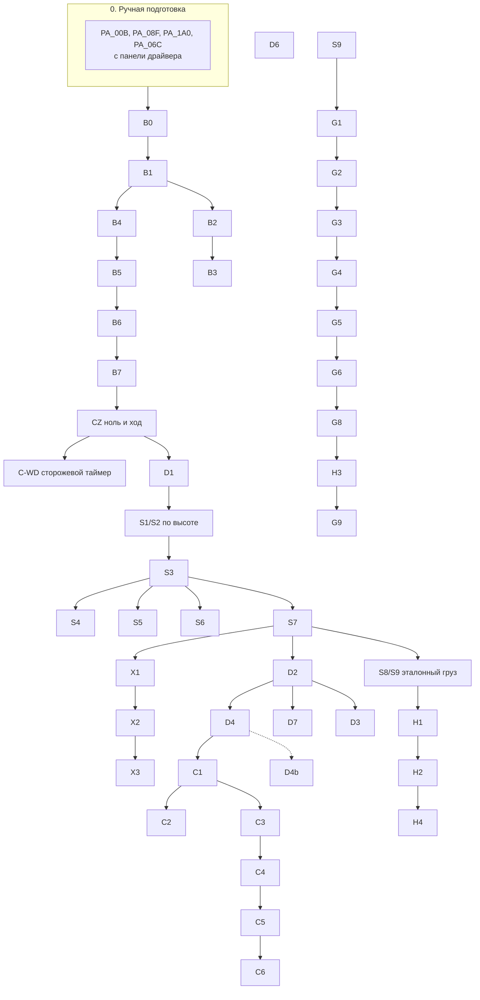

# 15. Каталог автокалибровок и интерфейс настройки тренажёра

> Статус: **проект (design), код не менялся.** Продолжение
> [14-motor-control-v2.md](14-motor-control-v2.md). Документ 14 описывает
> архитектуру v2. Здесь — **что именно измеряется** (каталог калибровок),
> **как из измерений получаются усилия упражнений** и **как это видно и
> настраивается в интерфейсе**. Старая реализация не дорабатывается:
> процедуры, параметры и экраны проектируются с нуля.

---

## 0. Факты из мануала A6, которые меняют проект

Источник: *Lichuan A6 Series AC Servo Drive Owner's Manual*, версия 2020-05-28.

| Факт | Где в мануале | Следствие |
|---|---|---|
| **PA_00B = 1 по умолчанию: энкодер работает как инкрементальный.** 0 — абсолютный, 2 — абсолютный без учёта переполнения. Действует после перезапуска питания | §6.1 | Многооборотный ноль не сохраняется, пока PA_00B не выставлен в 0 или 2 вручную (разово, с панели). CZ (§13.1 док. 14) без этого не работает. Модель R17 в таблице мануала не расшифрована (есть C17 — инкр., G17 — абс.): проверить опытом — PA_00B = 0 → три цикла питания → позиция совпадает, а при снятой батарее появляется Err 40 |
| **Err 40 — разряд или обрыв батареи абсолютного энкодера**, сбрасывается A-CLR | гл. 8 | В карту alarm. Батарею менять только при включённом питании |
| **Виртуальные DI по Modbus:** PA_1A0 (бит = вход управляется из PA_1A4), PA_1A4 (состояние), PA_1A5 (маска). DI0 по умолчанию = SRV-ON, функция 21 = **EMG** | §4.5.2, §6.2 | **Servo ON/OFF и EMG можно переключать из софта без проводки и без EEPROM.** PA_08F = 0 (включение по команде) вместо 1 (автовключение). Это даёт программный Servo OFF для C13 и FAULT |
| **PA_066 = 0 «DB (не поддерживается)»** | §6.1 | Динамического торможения нет. Совпадает с наблюдением «без питания гриф падает быстро». DB-спуск окончательно снят |
| Отдельного параметра таймаута связи в таблице нет. Есть **Err 3 «Communication errors… master suddenly stops accessing the servo»** | гл. 8 | Похоже, сторожевой таймер связи есть, но порог не настраивается. **Проверка C-WD** (§2.1): остановить опрос и измерить, через сколько секунд появится Err 3 и что сделает привод |
| Встроенный тормозной резистор **100 Вт / 40 Ом**, перемычка B2–B3. PA_06C — режим и защита (Err 18). Внешний — не менее 35 Ом | §2.1, §4.2, §6.1 | Пиковые 210 Вт на сторону — вдвое больше номинала резистора. Среднее за подход может пройти. C14 обязателен, внешний резистор — вероятная покупка |
| Мониторинг: **PA_1D9** — напряжение шины DC (В), **PA_1DA** — температура модуля (АЦП), **PA_1DB** — загрузка по моменту (%), **PA_1DC** — загрузка тормозного резистора (%), **PA_1DD** — перегрузка (%), **PA_1DE** — причина, почему мотор не крутится, **PA_1C3** — команда момента (0.1 %) | §6.2 | Тепло, рекуперацию и перегрузку можно читать напрямую, не только моделировать. Читать раз в 0.5–1 с, а не каждый тик |
| PA_1DE / код 12: **«Torque command is too small, less than 5 %»** | гл. 7 | Возможна мёртвая зона команды около 50 raw. Измеряется в калибровке D1 (§2.5) |
| PA_056 в Torque Mode = **ограничение скорости**, об/мин | §6.1 | Подтверждено. Асимметрию (вниз под весом не тормозит) измеряет D5 |
| PA_014 — фильтр команды момента (×10 мкс), PA_01D/01E/00A — режекторный фильтр | §5.4 | Ручки сглаживания «внутри привода». Резонанс винта подавляется режектором (D6) |
| PA_0A8…0B2 — **встроенная идентификация инерции**, только P/S режим. Результат PA_0AE (×10⁻⁶ кг·м²) | §6.2 | Независимая проверка C6: разово при пусконаладке, оператор временно переключает PA_002 с панели. Софт PA_002 не пишет |
| PA_002 = 10 — CANopen. PA_00C — скорость CAN | §6.1 | Не используется: CAN не нужен, только RS-485 |
| PA_1A7 = 0x0801 — сохранить всё в EEPROM | §9.5 | Остаётся в списке запрещённых команд |

Короткий список ручных действий при пусконаладке (один раз, с панели драйвера,
с записью в журнал): PA_00B = 0, PA_08F = 0, PA_1A0 bit0 = 1 (SRV-ON по
Modbus), PA_06C по фактическому резистору. Софт их **только читает и
сверяет**. Несовпадение → отказ старта с понятным текстом.

---

## 1. Физическая модель, на которой стоят все калибровки

Всё ниже — на **одну сторону** (L или R), в Н и мм, вверх = «+».

```
m·a = F_m + F_u − W(x) − F_f(x, v, история) + F_s
```

| Член | Что это | Откуда |
|---|---|---|
| `F_m` | сила мотора = `k(x)·raw` после привода (задержка τ, мёртвая зона, клип PA_05E) | B, D |
| `F_u` | сила пользователя | не измеряется, оценивается |
| `W(x)` | вес движущихся частей, может слегка зависеть от высоты (кабели, гриф на каретках) | S3 |
| `F_f` | трение: сухое `Fc⁺` вверх и `Fc⁻` вниз, разное у трогания и в движении (`Fs > Fc`), вязкое `c·v`, Stribeck, периодичность по обороту винта (32 мм), рост от времени стоянки | S, D |
| `m` | приведённая масса: гриф + каретка + **винт + ротор** ≈ 50–80 кг | D3 |
| `F_s` | связь с другой стороной через гриф | X2 |

### 1.1 Что должен делать мотор, чтобы пользователь чувствовал штангу L

Свободная штанга массой `M = L/g`: `F_u = M·g + M·a`. Подставляем в модель:

```
F_m = W(x) + F_f(x, v) − L + (m − M)·a        (на сторону L/2, M/2)
```

Отсюда видно, где берётся «разница усилия при подъёме и спуске»:

* **Подъём** (`v > 0`): трение мешает пользователю, мотор добавляет `+Fc⁺ + c·v`.
* **Спуск** (`v < 0`): трение помогает пользователю держать, мотор **убирает**
  его: `−Fc⁻ − c·|v|`. Без этого спуск кажется легче на `Fc⁺ + Fc⁻`, то есть
  ≈ 10 кгс на гриф (по замерам Fc ≈ 5 кгс на сторону).
* **Разворот** (`v ≈ 0`): знак трения не определён. Это и есть **окно
  невесомости** `[W − Fc⁻, W + Fc⁺]`. Переход между ветками сглаживается по
  скорости (`v_blend`, S-кривая). Ширина и форма перехода — главные ручки
  «естественности» разворота (G4).
* **Инерция:** `(m − M)·a`. При M < m мотор помогает разгонять, при M > m
  добавляет виртуальную массу. Ускорение берётся из наблюдателя,
  коэффициент ограничен устойчивостью (G3).

Пользователю иногда нужно **не** как у штанги. Поэтому для каждого
упражнения есть профиль: «штанга», «блок» (постоянная сила, инерция
компенсируется максимально), «эксцентрика +β», «ассист подъёма α» и т. д.
Все они — та же формула с другими коэффициентами.

### 1.2 Бюджет силы (главная визуализация, §5.3)

```
|F_m| ≤ min(F_PA05E, F_тепло(t), F_рекуперация(v), F_SafetyEnvelope)
```

Каждая калибровка либо уточняет один член уравнения, либо одно ограничение.
UI в любой момент показывает, какой член сейчас самый большой и какое
ограничение ближе всего.

---

## 2. Каталог калибровок

### 2.0 Общие правила

* Каждая калибровка — карточка с полями: **цель → предусловия → что делает
  машина → что делает оператор → безопасность → выход → критерии → время**.
* Только Torque Mode, только рампы и ступени момента, dead-man (удержание
  кнопки), огибающая по силе, скорости и ходу, автоматический abort.
* Каждое измерение — **≥ 3 повтора**, результат с ci95 и повторяемостью.
  Повторы чередуются по направлению, чтобы не копить нагрев и смазку в
  одну сторону.
* Отдельно для L и R. В конце сверка суммы на гриф.
* Сырые сэмплы сохраняются, `fit` можно перезапустить оффлайн.
* **Предусловия для всех:** гриф пуст (если не сказано иное), связь ок,
  температура модуля в рабочем окне, режим «сервис», нет пользователя под
  грифом (подтверждение).
* **Детектор трогания** (общий для S-группы): `|Δx| > 0.3 мм` **и**
  `v > 1.5 мм/с` по PA_1C1 в течение 3 кадров подряд. Порог подбирается в
  B4 по шуму покоя.

Группы:

| Код | Группа | Сколько |
|---|---|---:|
| B | Связь, привод, энкодер | 8 |
| S | Статика: трогание, баланс, невесомость | 9 |
| D | Динамика: трение в движении, масса, лаги, резонанс | 8 |
| X | Две стороны | 4 |
| H | Тепло, рекуперация, пределы привода | 5 |
| C | Регуляторы и безопасность | 7 |
| G | Ощущение нагрузки | 9 |
| U | Пользователь и упражнение | 5 |
| Q | Ежедневный контроль | 3 |

Итого **58 процедур**. Обязательная пусконаладка — около 25 из них
(мастер, §3), остальные — по требованию или автоматически по дрейфу.

### 2.1 B — связь, привод, энкодер

| Код | Название | Что измеряет | Как | Выход | Критерий |
|---|---|---|---|---|---|
| **B0** | Конфигурация привода | что параметры пусконаладки выставлены | чтение PA_002, 00B, 08F, 1A0, 06C, 05E, 056, 00D, 014 | отчёт «ок / что поправить» | всё совпадает с эталоном |
| **B1** | Тайминг шины | период, p50/p95/p99, ошибки, stale | 500 циклов без изменения команды; варианты 9/14 регистров, паузы, `latency_timer` | `loop_period_s`, `jitter_p95_s`, рекомендованная схема опроса | p99 < 2·p50, ошибки < 0.1 % |
| **B2** | Лаг команда → момент | задержка от записи PA_12C до PA_1C3 и PA_1C4 | ступень ±30 raw на упорах (без движения), 20 повторов | `cmd_to_torque_s`, `torque_rise_s` | разброс < 1 тика |
| **B3** | Лаг команда → движение | полная задержка контура | ступень вверх из окна невесомости, первое движение по энкодеру | `cmd_to_motion_s` | — |
| **B4** | Шум покоя | шум позиции и скорости, квантование | 10 с неподвижно на упорах | порог детектора трогания | шум < 0.05 мм |
| **B5** | Направление | знак raw ↔ знак движения | малая рампа вверх до 2 мм | `direction_sign` | однозначно |
| **B6** | Масштаб энкодера | мм на импульс; PA_1C1 против Δx/Δt | рулетка между двумя метками (оператор) + сравнение скоростей | `mm_per_pulse` | ±0.3 % к паспорту |
| **B7** | Абсолютный ноль | что ноль переживает выключение | PA_00B = 0 → 3 цикла питания на упорах | `zero_counts`, вердикт | |Δ| < 0.1 мм |
| **C-WD** | Сторожевой таймер связи | через сколько привод сам реагирует на молчание ПК | гриф на упорах, малая команда, опрос остановлен; ждём Err 3; повтор при +100 raw | `comm_timeout_s`, реакция привода | время и реакция известны. Если Err 3 не возникает — в чек-листе отмечается отсутствие аппаратной защиты |

### 2.2 S — статика (то, что вы назвали в пп. 1–3)

Это главная группа. Ось измерений — **высота x** (5–9 точек по ходу).
Строится **карта**, а не одно число.

#### S1. Усилие трогания вверх `F_up(x)` — п. 1

* **Цель:** минимальная сила мотора, при которой каретка трогается вверх из
  покоя.
* **Как:** из состояния «стоит» (на упорах для x = 0, в остальных точках —
  удержание) медленная рампа `+r` Н/с (r ≈ 2 % W/с; в тестах проверяется,
  что результат не зависит от r при r ≤ 3 %). Момент трогания →
  `F_up = F_m(t_trog − τ)` с поправкой на лаг из B3. Сразу после трогания
  рампа сбрасывается на `F_up − 0.5·Fc`, чтобы не разогнаться.
* **Повторы:** 5 на точку, чередуя с S2.
* **Выход:** `F_up(x)`, разброс.

#### S2. Усилие трогания вниз `F_dn(x)` — п. 2

* **Цель:** максимальная сила мотора, при которой каретка ещё стоит, а при
  меньшей начинает ползти вниз.
* **Как:** из удержания медленная рампа `−r`. Трогание вниз → немедленный
  возврат к `F_dn + 0.5·Fc` (тормоз трением). Ход ограничен 10 мм, точки
  берутся снизу вверх, чтобы падать было некуда (с нижней точки — 0 мм до
  упоров).
* **Выход:** `F_dn(x)`.

#### S3. Баланс и сухое трение (производная S1+S2)

```
W(x)  = (F_up + F_dn)/2
Fs⁺   = F_up − W         (трогание вверх)
Fs⁻   = W − F_dn         (трогание вниз)
```

Если `Fs⁺ ≠ Fs⁻` больше погрешности — трение несимметрично (типично для
ШВП с вертикальной нагрузкой: нагружена одна сторона гайки). Модель
хранит обе величины.

#### S4. Окно невесомости и его оптимум — п. 3

* **Окно:** `[F_dn(x), F_up(x)]` — любая сила внутри держит гриф неподвижным.
* **«Оптимальная невесомость»** — это не одно число, а выбор по критерию:

| Цель | Точка в окне | Когда |
|---|---|---|
| Гриф не уползает сам | середина `W` | по умолчанию |
| Минимальная сила, чтобы поднять рукой | ближе к `F_up`: `F_up − δ` | упражнения «от низа» |
| Минимальная сила, чтобы опустить | ближе к `F_dn`: `F_dn + δ` | упражнения «от верха» |
| «Как в воде» | динамическая компенсация трения по скорости (G4) | лучший вариант |

* **Как:** в S4 машина **сама проверяет** выбранную точку: ставит `F*`,
  ждёт 5 с (дрейф < 0.5 мм), затем внешнего толчка нет — оператор слегка
  толкает гриф вверх и вниз. Измеряется сила, нужная пользователю
  (`breakaway_user_n` по оценщику), с обоих направлений.
* **Выход:** `weightless_point(x)`, `δ_safe(x)` (запас до края окна с учётом
  разброса S1/S2 и дрейфа температуры), «лёгкость» в кгс вверх и вниз.

#### S5. Зависимость трогания от времени стоянки (ползучесть)

* После 1 / 5 / 30 / 120 с неподвижности сила трогания растёт (смазка
  выдавливается). Повтор S1 с разной выдержкой.
* **Выход:** `Fs⁺(t_dwell)`. Нужен для старта подхода после отдыха: первый
  повтор «тяжелее», мотор добавляет `ΔFs(t_rest)` на первые миллиметры.

#### S6. Периодичность по обороту винта

* S1/S2 с шагом 4 мм на одном обороте (32 мм) в 2–3 местах хода.
* **Выход:** гармоники с периодом 32 мм (биение винта, неравномерность гайки)
  и, если есть, 16 мм. Если амплитуда > 10 % Fc — включается таблица
  компенсации по фазе оборота.

#### S7. Карта по высоте (сборка S1–S3)

* 9 точек от 50 мм до `travel − 50`. Гладкий сплайн `W(x)`, `Fc⁺(x)`, `Fc⁻(x)`
  с проверкой на выбросы.
* Видно перекос рельс, тугие места, провис кабеля.

#### S8. Нагрузочная зависимость трения

* Трение ШВП растёт с осевой нагрузкой. S1/S2 повторяются с эталонным грузом
  0 / 10 / 20 кг на сторону (оператор вешает).
* **Выход:** `Fc(N) = Fc₀ + μ·N`. Без этого компенсация трения правильна
  только для пустого грифа, а под 100 кг ошибается на неизвестную величину.

#### S9. Шкала силы по эталонному грузу (бывшая C4)

* Тот же прогон S8 даёт `ΔW / Δm·g` → `k_n_per_raw` отдельно L и R.
  Линейность по трём точкам (0/10/20 кг) — проверка, что шкала не зависит
  от уровня момента.

### 2.3 D — динамика

| Код | Название | Как | Выход |
|---|---|---|---|
| **D1** | Мёртвая зона и линейность команды | на упорах: ступени raw 0, ±10…±100 с шагом 10, сравнение PA_1C3/PA_1C4 с командой; затем S9 при разных уровнях | `deadband_raw`, нелинейность (таблица поправки) |
| **D2** | Трение в движении вверх `F_f⁺(v)` | ступени постоянной силы `W + Fc + Δᵢ` (6 уровней), установившаяся скорость на 150–300 мм | `Fc_kin⁺`, `c⁺`, Stribeck `v_s` |
| **D3** | Трение в движении вниз `F_f⁻(v)` | ступени `W − Fc − Δᵢ` с жёстким governor (`v ≤ 80 мм/с`), только малые Δ, старт сверху, путь ≤ 200 мм | `Fc_kin⁻`, `c⁻` |
| **D4** | Приведённая масса `m` | меандр силы вокруг баланса ±0.3 Fc с периодом 1–3 с, ход ≤ 50 мм, регрессия по сплайну позиции; отдельно вверх и вниз | `m`, `m⁺/m⁻` (разница выдаёт ошибку модели трения) |
| **D4b** | Независимая проверка инерции | встроенная идентификация драйвера PA_0AF (оператор переключает PA_002 в S с панели, затем обратно) | `J_total` → `m = J·(2π/p)²` |
| **D5** | Поведение PA_056 | подъём с силой выше баланса при PA_056 = 100/200/300 об/мин; спуск — то же | фактический предел вверх и вниз, асимметрия |
| **D6** | Резонансы | чирп малой амплитуды 2–80 Гц поверх удержания, спектр PA_1C4 и позиции; подъём со скоростью до 0.8·v_max | частоты резонансов, рекомендация PA_01D/01E/00A, PA_014; подтверждение критической скорости |
| **D7** | Переходный процесс на развороте | серия «вверх 50 мм → вниз 50 мм» силой ±Δ вокруг W, разные скорости | длительность и форма «прилипания» при смене знака, `v_blend` для G4 |

### 2.4 X — две стороны

| Код | Название | Выход |
|---|---|---|
| **X1** | Симметрия сторон: одинаковый raw L и R → скорости, перекос | `k_L/k_R` |
| **X2** | Связь через гриф: разностная сила ±δ → установившийся перекос | `side_coupling_n_per_mm` |
| **X3** | Допустимый перекос: медленное увеличение разности до заметного роста трения (S1 одной стороной при перекосе 0/2/5 мм) | `max_skew_mm`, вход SafetyEnvelope |
| **X4** | Передача нагрузки при асимметричном хвате: оператор давит на один край | проверка, что `sync` не раскачивает |

### 2.5 H — тепло, рекуперация, пределы привода

| Код | Название | Как | Выход |
|---|---|---|---|
| **H1** | Фактический максимум силы | на упорах (упирается в них — без движения) рампа вниз до PA_05E; сверка PA_1C4 | `F_max_side` |
| **H2** | Тепловая модель | изометрия на упорах при 40 / 60 / 80 % номинала по 3 мин, PA_1DD, PA_1DA, PA_1DB | `τ_therm`, `I²t` предел, кривая «сколько секунд при силе F» |
| **H3** | Рекуперация (C14) | эксцентрические повторы с растущей нагрузкой и скоростью; PA_1D9, PA_1DC | `P_regen_max`, `E_burst`, допустимое `F·v` вниз |
| **H4** | Остывание | после H2 — спад PA_1DD | `τ_cool`, время отдыха до полной мощности |
| **H5** | Перегрузочная кривая привода | PA_072 и фактическое время до Err 16 по модели (без доведения до аварии) | запас в SafetyEnvelope |

### 2.6 C — регуляторы и безопасность

| Код | Название | Выход |
|---|---|---|
| **C1** | Удержание: relay test в 3 точках высоты | `K_u(x)`, `T_u(x)` → `hold.k, c` |
| **C2** | Демпфирование невесомости: толчки разной силы, затухание | `weightless.damping` |
| **C3** | Опускание поддержкой: `support_raw` → скорость опускания с 50/300/800 мм | `support_raw[side]` для 15 мм/с ±5 |
| **C4** | STOP-float: сильное демпфирование вместо опускания; гриф не уходит сам, но выталкивается рукой | `float_damping`, сила вытолкнуть |
| **C5** | Тормозной путь: из движения v → поддержка | `stop_distance(v)` |
| **C6** | Падение при Servo OFF (через виртуальный SRV-ON) с 50 → 100 → 200 мм | `a_fall`, путь до упоров (оценка «что будет при отказе») |
| **C7** | Деградация связи: инъекция пропусков кадров (софтом) в удержании | проверка политики §13.8 док. 14 |

### 2.7 G — ощущение нагрузки (то, ради чего всё)

| Код | Название | Как | Выход |
|---|---|---|---|
| **G1** | Статическая точность | эталонный груз `m_ref` на гриф, режим «штанга» с `L = m_ref` → баланс (дрейф 0, `F_u ≈ 0`); затем `L = m_ref ± 2` → дрейф в ожидаемую сторону | `ε_static` |
| **G2** | Подъём против спуска | `L = m_ref`, оператор медленно поднимает и опускает руками; оценщик `F_u` вверх и вниз должен быть одинаковым | `ε_up`, `ε_down`, подстройка `g_f⁺`, `g_f⁻` отдельно |
| **G3** | Инерция `g_m(L)` | для L = 0, 10, 20, 40, 60, 80, 100 кг: машина сама делает толчки силы (без человека) и сравнивает фактическое `a` с ожидаемым для массы `M = L/g`; бисекция `g_m` до границы устойчивости × 0.6 | таблица `g_m(L)`, `inertia_err_kg(L)` |
| **G4** | Разворот | D7 + человек: повторы с разной скоростью, оценивается скачок `F_u` на смене знака | `v_blend`, форма S-кривой |
| **G5** | Плавность фаз | переход подъём/спуск для эксцентрики/ассиста; скачок `dF/dt` | `phase_blend_s` |
| **G6** | Скоростной предел «вязкая стена» | взрывные подъёмы с лёгким весом, governor от 0.8·v_max | крутизна governor, отсутствие рывка |
| **G7** | Первые миллиметры после отдыха | S5 в боевом режиме: подход после паузы 60 с | `ΔFs(t_rest)` компенсация |
| **G8** | Оценщик силы пользователя | груз как «пользователь»: сравнение `F_u_est` с `m_ref·g` в покое, на подъёме, на спуске | ошибка оценщика по фазам; пороги захвата/отпускания/отказа |
| **G9** | Сквозная проверка упражнения | для 5 опорных упражнений: 1 подход владельца + запись, отчёт по `load_err` по фазам, рывки, синхронизация | паспорт упражнения |

### 2.8 U — пользователь и упражнение

| Код | Название | Выход |
|---|---|---|
| **U1** | Диапазон упражнения (низ/верх) — существующая функция, теперь в абсолютных мм | `rom_mm` |
| **U2** | Точка безопасного STOP для упражнения: где лежат упоры относительно тела, `stop_behavior` | `lower | float` |
| **U3** | Пробный подход с 20 % нагрузки: скорость и ROM пользователя | стартовые пороги повторов |
| **U4** | Ощущение «легче/тяжелее»: пользователь оценивает 3 варианта `g_f, v_blend` вслепую (A/B) | персональный сдвиг ±10 % в пределах безопасного |
| **U5** | Подбор 1ПМ по скорости (VBT) | рекомендуемые веса |

### 2.9 Q — ежедневный контроль

| Код | Что | Время |
|---|---|---|
| **Q1** | При включении: B0, ноль (B7 без циклов питания), S1+S2 в одной точке, C3 | ≈ 20 с |
| **Q2** | Во время работы: оценка `W`, `Fc` по каждому медленному участку повторов (пассивно, без отдельной процедуры) | постоянно |
| **Q3** | Еженедельно: S7 в 3 точках, D2, X1 | ≈ 3 мин |

Порог дрейфа: `|ΔW| > 7 %` или `|ΔFc| > 25 %` → предупреждение; > 15 % →
нагрузка ограничена до перекалибровки.

---

## 3. Мастер пусконаладки (порядок и зависимости)



| Этап мастера | Процедуры | Оператор | Время |
|---|---|---|---|
| 1. Привод и связь | B0–B4, C-WD | нет | 3 мин |
| 2. Геометрия | B5–B7, CZ | рулетка, 3 цикла питания | 10 мин |
| 3. Статика | D1, S1–S7 | нет | 15 мин |
| 4. Груз | S8, S9, H1 | вешает 10 и 20 кг на каждую сторону | 15 мин |
| 5. Динамика | D2–D4, D7, X1–X3 | нет | 10 мин |
| 6. Регуляторы | C1–C6 | dead-man | 10 мин |
| 7. Тепло | H2, H4 | нет (можно уйти) | 15 мин |
| 8. Ощущение | G1–G8, H3 | груз + руки | 20 мин |
| 9. Упражнения | G9, U2 | подходы | по желанию |

Мастер можно прервать на любом этапе. Каждый этап даёт **рабочий** профиль:
после этапа 3 уже есть невесомость, после 4 — правильные кг, после 8 —
полноценное ощущение штанги.

---

## 4. Автоматика поверх калибровок

* **Автопроверка модели.** После каждой калибровки двойник с новым профилем
  повторяет её на себе. Если предсказание расходится с замером > порога,
  процедура помечается «модель не объясняет данные» (например, трение зависит
  от нагрузки, а S8 не сделан).
* **Перекрёстные проверки** (автоматически в отчёте):
  * `W` из S3 и из D2/D3 (среднее веток) — совпадают ±3 %;
  * `m` из D4 и D4b — ±15 %;
  * `k` из S9 и паспорт — ±25 %;
  * `Fs` (S) ≥ `Fc_kin` (D) — иначе ошибка детектора;
  * сумма L+R против груза на грифе — ±3 %.
* **Автотюнер** (§7.5 док. 14) берёт профиль и ci95, подбирает `g_f⁺, g_f⁻,
  g_m(L), v_blend, hold.*, damping` на ансамбле двойников и выдаёт кандидата.
  G-калибровки подтверждают его на железе.
* **Тесты на двойнике для каждой процедуры:** известная случайная физика →
  процедура → оценка в допуске (сотни seeds). Это и есть «много тестов,
  которые сами подбирают параметры» из док. 14 §7.

---

## 5. Интерфейс отладки и настройки

Отдельный раздел «Сервис → Тренажёр», только в сервисном режиме. Девять
экранов. Все графики — L и R зеркально (левая сторона слева), одинаковые
цвета во всём приложении:

| Цвет | Смысл |
|---|---|
| синий | левая сторона |
| оранжевый | правая сторона |
| серый | вес `W` |
| коричневый | трение |
| фиолетовый | инерция |
| зелёный | нагрузка пользователя / цель |
| красный | пределы и нарушения |

### 5.1 «Обзор» (стартовая страница)

```
┌───────────────────────────────────────────────────────────────────┐
│ Профиль v14 · 03.10 · калибровка 92 % · Q сегодня ✔               │
├──────────────┬──────────────┬──────────────┬──────────────────────┤
│ Связь        │ Привод L/R   │ Тепло L/R    │ Ноль / позиция       │
│ 18 мс p95 24 │ ✔ / ✔        │ ▓▓░░ 34 %    │ 0.0 / 0.1 мм ✔       │
│ ошибок 0.0 % │ Err —        │ ▓▓░░ 31 %    │ перекос 0.1 мм       │
├──────────────┴──────────────┴──────────────┴──────────────────────┤
│ Граф калибровок (DAG): ● актуально ● устарело ● не делалось       │
│  B0●─B1●─B2● … S1●─S3●─S4● … G3● G4●                              │
├───────────────────────────────────────────────────────────────────┤
│ Предупреждения: «Трение L выросло на 18 % за 30 дней — смазать»   │
└───────────────────────────────────────────────────────────────────┘
```

### 5.2 «Калибровки» (каталог + запуск)

* Слева — список групп B/S/D/X/H/C/G/U/Q, карточки со статусом, датой,
  ключевым числом и мини-спарклайном истории.
* Справа — выбранная карточка: цель, предусловия (чек-боксы с автопроверкой),
  что сделает машина (анимированная схема хода), что сделать оператору,
  время, кнопка **«Запустить (удерживать)»**.
* **Во время прогона** — экран прогона:
  * живой график процедуры (сила, позиция, скорость) с огибающей
    безопасности красным пунктиром;
  * маркеры событий («трогание вверх», «abort»);
  * прогресс повторов и точек высоты;
  * крупная кнопка **СТОП**.
* **После** — отчёт: значение ± ci95, точки повторов, график подгонки с
  остатками, сравнение с прошлым профилем, перекрёстные проверки,
  светофор-вердикт и «Принять / Отклонить / Повторить».

### 5.3 «Карта машины» (главная визуализация физики)

Четыре панели, по умолчанию для текущей высоты, слайдер высоты внизу.

1. **Окно невесомости (S4)** — горизонтальная шкала силы на сторону:

   ```
   L  ◀ падает ▕▒▒▒▒▒▒▒▒ стоит ▒▒▒▒▒▒▒▒▏ едет вверх ▶
               F_dn 52 Н    ▲W 68    F_up 86 Н
                         ◆ текущая команда 70 Н
   R  ◀ падает ▕▒▒▒▒▒▒▒▒ стоит ▒▒▒▒▒▒▏ едет вверх ▶
   ```
   Ромб — текущая сила мотора в реальном времени. Тень — разброс повторов.
   Отсюда сразу видно, почему гриф ползёт.

2. **Диаграмма «сила–скорость»** (F–v): по X скорость −300…+300 мм/с, по Y
   сила трения. Точки — замеры D2/D3 и S1/S2 (на v = 0 вертикальная
   «ступенька» трогания), линия — подогнанная модель, зелёная линия —
   компенсация, которую сейчас даёт мотор (с `g_f`). Зазор между линиями —
   то, что чувствует пользователь сверх нагрузки. Живая точка текущего
   состояния бегает по графику.

3. **Карта по высоте**: X — высота 0…1850 мм, Y — сила. Серая линия `W(x)`,
   коричневые полосы `±Fc(x)`, отметки S6-периодичности, вертикальные метки
   диапазонов упражнений и мягких пределов. L и R наложены.

4. **Бюджет силы** (водопад) — что складывается в команду прямо сейчас:

   ```
   W 68 │████████
   +Fc  │   ███ 22
   +m·a │      ██ 14
   −L   │████████████████ −245
   ─────┼─────────────────────────────
   F_m  │ −141 Н   предел ±490 ▕──────┤ 29 %
   тепло ▓▓░░ 34 %   рекуперация ▓░░ 12 %
   ```

### 5.4 «Осциллограф»

* До 12 каналов из любых величин (сырые регистры, оценки, команды, режимы),
  группировка L/R, общая ось времени.
* Триггеры: по режиму, по превышению, по событию (FAULT, разворот, захват).
* Пре-триггер из чёрного ящика (60 с) — можно открыть то, что было до
  события.
* Курсоры Δt/Δy, измерение лага между каналами, экспорт CSV, «отправить в
  replay-тест» (сохраняет как фикстуру T7).
* Пресеты: «Удержание», «Разворот», «Шина», «Тепло», «Синхронизация».

### 5.5 «Песочница ощущения»

Для подгонки упражнений «до идеала».

* Выбор упражнения и профиля («штанга», «блок», «эксцентрика», …), нагрузки.
* Большой график последних повторов: **целевая сила пользователя** (зелёная)
  против **оценённой фактической** (чёрная), фон закрашен по фазам
  (подъём/разворот/спуск). Ниже — ошибка в кгс и %.
* Наложение повторов (ensemble) по фазе: видно систематику — «на развороте
  вверх всегда +4 кгс».
* Ползунки ручек справа (`g_f⁺`, `g_f⁻`, `g_m`, `v_blend`, `phase_blend`) с
  **безопасными диапазонами** от автотюнера (зелёная зона на ползунке,
  за ней — блок). Изменения применяются со следующего повтора, есть
  «A/B вслепую» (U4).
* Кнопка «Сохранить как профиль упражнения».

### 5.6 «Двойник»

* Тот же интерфейс песочницы, но против цифрового двойника: выбор виртуального
  пользователя, сбоев, физики (текущий профиль ± разброс).
* «Предсказание / железо»: наложение траектории записи и двойника, RMS.
* Запуск автотюнера с прогрессом и паспортом метрик.

### 5.7 «Профили и история»

* Версии `MachineProfile` и `Tunables`, diff по полям (значение, ci95,
  provenance, процедура-источник), активация, откат.
* Тренды ключевых величин по времени (W, Fc⁺, Fc⁻, m, лаг, тепло) с
  метками калибровок и обслуживания («смазка 12.09»).

### 5.8 «Регистры» (существующий debug)

Остаётся. Добавляются: подписи к регистрам из мануала, единицы, подсветка
запрещённых для записи, панель «пусконаладочные параметры» с эталоном и
отклонениями (B0).

### 5.9 «Безопасность»

SafetyEnvelope с объяснением каждого предела: откуда число (процедура,
формула), какое событие срабатывает, когда последний раз проверялось
(C5/C6/C-WD). Журнал срабатываний.

### 5.10 Принципы интерфейса

* **Каждое число кликабельно:** откуда оно, какая процедура, график
  источника, история.
* **Нет «голых» параметров.** Вместо 152 полей — ≈ 20 ручек с понятными
  названиями («Лёгкость подъёма», «Лёгкость спуска», «Плавность разворота»,
  «Тяжесть разгона») и единицами в кгс. Сервисные числа — только в карточках
  калибровок.
* **Всегда видно, что машина делает сейчас:** строка состояния на всех
  сервис-экранах — режим, сила L/R, скорость, позиция, кто владелец
  управления, большая кнопка СТОП.
* **Любое действие с движением — удержание кнопки** (dead-man), с
  индикатором огибающей.
* Темп обновления: 20–50 Гц через один WS-канал телеметрии, графики — canvas.

---

## 6. Данные и API (дополнение к §8 док. 14)

| Метод | Путь | Назначение |
|---|---|---|
| GET | `/api/motor/calibrations` | каталог: код, группа, статус, последнее значение |
| GET | `/api/motor/calibrations/{code}` | карточка: описание, предусловия (с проверкой), история |
| POST | `/api/motor/calibrations/{code}/run` | запуск (сервис + dead-man канал) |
| GET | `/api/motor/runs/{id}` | отчёт: значения, ci95, сэмплы, подгонка, перекрёстные проверки |
| POST | `/api/motor/runs/{id}/accept` | применить в новый профиль |
| GET | `/api/motor/map?x=` | карта машины на высоте x (окно, F–v, бюджет) |
| GET | `/api/motor/blackbox/{event}` | 60 с до и после события |
| POST | `/api/motor/sandbox` | применение ручек ощущения (временно, до сохранения) |
| WS | `/api/motor/telemetry` | единый поток, подписка на каналы |

Хранение: `calibration_runs` (сырые сэмплы в файле, ссылка в БД),
`machine_profiles` с версиями, `exercise_feel_profiles` (ручки ощущения на
упражнение и пользователя).

---

## 7. Тесты калибровок

| Уровень | Что проверяется |
|---|---|
| Идентификация | каждая процедура на двойнике с известной случайной физикой восстанавливает её в допуске (S1/S2 ±3 %, Fc ±10 %, m ±10 %, k ±3 %, лаг ±1 тик) |
| Чувствительность | результат не зависит от скорости рампы, порога детектора и шума в рабочих пределах |
| Безопасность процедуры | ни одна процедура не выходит за огибающую при сбоях шины, отпускании dead-man, неожиданной силе пользователя |
| Перекрёстные проверки | инъекция ошибки (неверный `k`, забытый груз, нагрузочное трение без S8) обнаруживается |
| Мастер | случайная машина + плохие дефолты → мастер → метрики G-группы в норме |
| Replay | реальные прогоны процедур на железе перепрогоняются через `fit` при каждом изменении кода |

---

## 8. Вопросы, оставшиеся открытыми

1. Выставлен ли PA_00B = 0 сейчас, и есть ли батарейный блок у энкодера
   (провода E+/E−)?
2. Готовы ли вы один раз переключить PA_08F = 0 и PA_1A0 bit0 = 1, чтобы
   Servo ON управлялся по Modbus?
3. Перемычка B2–B3 на месте (встроенный резистор 100 Вт)?
4. Какой эталонный груз будет: 10 и 20 кг (нужны два для линейности S8/S9)?
5. Какие 5 упражнений взять опорными для G9?
