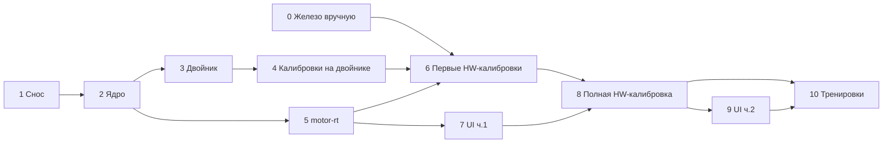

# 16. План реализации управления двигателями v2

> Основа: [14-motor-control-v2.md](14-motor-control-v2.md) (архитектура) и
> [15-motor-calibrations-and-tuning-ui.md](15-motor-calibrations-and-tuning-ui.md)
> (калибровки и интерфейс). Здесь — **порядок работ**: этапы, задачи, файлы,
> тесты и критерии приёмки. Каждый этап заканчивается зелёным CI и рабочим
> состоянием машины.

---

## 0. Правила для всех этапов

* **Ветка на этап**, merge только при зелёных тестах:
  `cd backend && DATABASE_URL=sqlite:////tmp/x.db ../.venv/bin/python -m pytest app/tests -q`,
  `ruff check`, `npm run build` во frontend.
* Ядро (`force/`, `estimation/`, `supervisor/`, `calibration/fit`) — **чистые
  функции без I/O**. Время, случайность и транспорт инжектируются.
* Единицы внутри — Н, мм, с. raw только в `drive/`.
* Код никогда не пишет PA_000, PA_002, PA_090, PA_00B, PA_08F, PA_1A7 и
  EEPROM. Это проверяет тест на уровне `drive/registers.py`.
* Каждая новая процедура калибровки сначала проходит тесты на двойнике
  (идентификация, ≥ 50 seeds), только потом допускается на железо.
* Любое движение на железе — dead-man и огибающая безопасности.
* Метка «HW» у задачи = нужна машина и оператор.

---

## Этап 0. Подготовка железа (вручную, с панели драйвера)

Делается один раз владельцем, результат записывается в
`docs/common/drive-commissioning.md`.

| # | Действие | Проверка |
|---|---|---|
| 0.1 | Записать текущие значения всех PA_0xx обоих драйверов (фото / выгрузка через debug-экран) | файл с дампом в репозитории |
| 0.2 | PA_00B = 0 (абсолютный энкодер), перезапуск питания | при снятом разъёме батареи появляется Err 40 |
| 0.3 | PA_08F = 0, PA_1A0 bit0 = 1 (SRV-ON по Modbus), DI0 = 0 (SRV-ON) | без записи PA_1A4 мотор не включается (PA_1DE = 2) |
| 0.4 | Проверить перемычку B2–B3, PA_06C = 0 | фото клемм |
| 0.5 | `lsusb`, определить чип USB-RS485 | записано |
| 0.6 | Найти эталонные грузы 10 и 20 кг, взвесить | записано |

Если 0.2 не проходит (энкодер не абсолютный) — этап 6 переходит на
вариант «ноль по нижнему упору при каждом старте» (док. 14 §13.1, вариант C).

---

## Этап 1. Снос старого стека (M0)

**Цель:** старый код удалён, сервер работает в безопасном минимальном
режиме, тренировочный UI честно говорит «управление отключено».

| # | Задача | Файлы |
|---|---|---|
| 1.1 | Выписать требования из `test_motion_backup_torque.py`, `test_modbus_torque_runtime.py`, `docs/common/backup-torque.md` в `backend/app/motor/SAFETY_REQUIREMENTS.md` (список T6) | новый файл |
| 1.2 | Выгрузить 152 старых параметра из `app_settings` в архивный JSON (скрипт) | `backend/scripts/archive_motion_params.py` |
| 1.3 | Удалить `services/motion/{controller,torque,procedures,emulator,parameters,modbus_adapter}.py`, моторную часть `hardware_runtime.py`, маршруты `/tuning/*`, их тесты | backend |
| 1.4 | Удалить экран `frontend/src/screens/mechanics-tuning/**` и ссылки | frontend |
| 1.5 | Временный `motor/legacy_safe_runtime.py`: раз в 200 мс пишет PA_12C = +100 на обе стороны, обрабатывает STOP/ESTOP, отдаёт позицию в UI | backend |
| 1.6 | Тренировка и `exercise-setup`: заглушка «управление двигателями переводится на v2» | frontend |

**Тесты:** остальной suite зелёный; новый тест «runtime пишет только +100 и
только в PA_12C».
**Приёмка (HW):** сервер стартует, гриф лежит на упорах, debug-экран
работает.

---

## Этап 2. Каркас и чистое ядро (M1)

| # | Задача | Файлы |
|---|---|---|
| 2.1 | `motor/units.py`: Н/кгс/мм, конверсии, типы | |
| 2.2 | `motor/profile.py`: `MachineProfile`, `Tunables`, `SafetyEnvelope`, `Measured[T]` (value, ci95, provenance, run_id, ts), JSON-схема, версия | |
| 2.3 | Alembic-миграция: `machine_profiles`, `calibration_runs`, `exercise_feel_profiles` | `alembic/versions/…` |
| 2.4 | `drive/registers.py`: карта используемых регистров (из мануала, §0 док. 15), белый список записи, alarm-коды (вкл. Err 3, 40) | |
| 2.5 | `drive/protocol.py`: `DriveSample`, `TorqueDrive`, `servo_on/off` через PA_1A4 | |
| 2.6 | `estimation/observer.py` (α-β с реальным dt и компенсацией задержки), `friction.py` (Coulomb±, viscous, Stribeck, сглаженный знак, нагрузочная зависимость), `user_force.py` (с достоверностью moving/static) | |
| 2.7 | `force/`: `compensation`, `load_models` (barbell/cable/eccentric/assist/curve/isokinetic), `virtual_spring`, `governor`, `sync`, `shaping` | |
| 2.8 | `supervisor/modes.py` (FSM 10 режимов, таблица переходов), `safety.py`, `reps.py`, `stop_behavior` | |
| 2.9 | Тесты T1 (hypothesis) и T6 из 1.1 | `app/tests/motor/` |

**Приёмка:** ≥ 200 unit/property тестов; покрытие ядра ≥ 90 %; тик ядра
< 1 мс.

---

## Этап 3. Цифровой двойник и метрики (M2)

| # | Задача |
|---|---|
| 3.1 | `twin/plant.py`: две стороны, связь через гриф, трение по §1 док. 15 (включая ползучесть S5, гармоники винта S6, нагрузочное трение S8) |
| 3.2 | `twin/drive_model.py`: квантование, мёртвая зона < 5 %, PA_05E clamp, PA_056 асимметричный, лаг PA_1C4, Err 3 по молчанию, регистры мониторинга 1D9–1DE, шина DC + резистор 100 Вт, тепловая I²t |
| 3.3 | `twin/bus_model.py`: задержка, джиттер, потери, stale, нулевой кадр, CRC |
| 3.4 | `twin/users.py`: виртуальные пользователи (док. 14 §7.3) и «эталонный груз» |
| 3.5 | `twin/randomize.py`: распределения вокруг паспорта, seed |
| 3.6 | `tuning/metrics.py`: метрики §7.2 док. 14 + `inertia_err_kg`, `load_err` по фазам |
| 3.7 | `twin/fit_to_logs.py`: подгонка двойника по записям (пока по старым `recordings`) |

**Приёмка:** двойник воспроизводит имеющиеся реальные записи с RMS < 3 мм
(если записей мало — условно, повтор на этапе 6).

---

## Этап 4. Движок калибровок и процедуры на двойнике (M3–M4)

| # | Задача |
|---|---|
| 4.1 | `calibration/runner.py`: генераторы шагов, dead-man, огибающая, abort, повторы, сохранение сырых сэмплов |
| 4.2 | `calibration/fit.py`: робастный МНК, bootstrap ci95, детектор трогания, сплайны |
| 4.3 | `calibration/graph.py`: DAG зависимостей, статусы, устаревание |
| 4.4 | `calibration/crosscheck.py`: перекрёстные проверки (док. 15 §4) |
| 4.5 | Процедуры партиями, каждая с тестами идентификации: |
| | • **4.5a** B0–B7, C-WD |
| | • **4.5b** D1, S1–S9 |
| | • **4.5c** D2–D7, X1–X4 |
| | • **4.5d** H1–H5, C1–C7 |
| | • **4.5e** G1–G8, U1–U5, Q1–Q3 |
| 4.6 | `calibration/wizard.py`: 9 этапов мастера, сборка кандидат-профиля, верификация |
| 4.7 | `tuning/autotune.py`: сетка + CMA-ES, паспорт метрик, безопасные диапазоны ручек |
| 4.8 | Тесты T2–T5: идентификация (≈ 600 кейсов в CI), мастер на 20 машинах (CI) / 200 (nightly), робастность ±20 % |

**Приёмка:** все процедуры восстанавливают физику двойника в допусках
док. 15 §7; мастер + автотюнер на случайной машине дают G-метрики в норме.

---

## Этап 5. Процесс `motor-rt` и HAL (M5, часть 1)

| # | Задача |
|---|---|
| 5.1 | `hal/bus.py` поверх транспорта `modbus_service` (lock, drain, повторы), `hal/timing.py` |
| 5.2 | `drive/lichuan.py`: `TorqueDrive` для A6; чтение мониторинга раз в 0.5–1 с; servo on/off через PA_1A4 |
| 5.3 | `motor/rt/main.py`: отдельный процесс, цикл read → estimate → supervise → law → safety → write; SCHED_FIFO, привязка к ядру; переход в поддержку при молчании API > 200 мс |
| 5.4 | IPC: локальный Unix-сокет, протокол уставок и телеметрии (msgpack), версия протокола |
| 5.5 | systemd-юнит `egym-motor-rt.service`, udev-правило `latency_timer=1` для `ftdi_sio`, правка `start-watch.sh` (backend перезапускается, `motor-rt` — нет) |
| 5.6 | Чёрный ящик: кольцевой буфер 60 с, сброс на диск по событиям |
| 5.7 | Dry-run режим (T9) |
| 5.8 | Удалить `legacy_safe_runtime.py` |

**Тесты:** `motor-rt` против двойника через тот же IPC (интеграционные), kill
API → поддержка через 200 мс, kill `motor-rt` → двойник даёт Err 3.

---

## Этап 6. Первые калибровки на железе (M5, часть 2) — HW

| # | Задача | Критерий |
|---|---|---|
| 6.1 | B0, B1, B4: конфигурация, тайминг, шум | p99 < 2·p50 |
| 6.2 | C-WD: время и реакция на Err 3 | известно, записано |
| 6.3 | B5, B6, B7 + CZ: направление, масштаб, абсолютный ноль, ход | ноль совпадает после 3 циклов питания |
| 6.4 | D1, S1–S4 в 3 точках | повторяемость < 5 % |
| 6.5 | C3: `support_raw`, плавное опускание | 15 ± 5 мм/с |
| 6.6 | Q1 при каждом старте | стабильна 3 старта подряд |
| 6.7 | Подгонка двойника по реальным прогонам (3.7) | RMS < 3 мм |

---

## Этап 7. Сервисный интерфейс, часть 1

Параллельно с этапами 5–6.

| # | Экран (док. 15 §5) | Ключевые компоненты |
|---|---|---|
| 7.1 | Общий слой: WS-телеметрия с подпиской, строка состояния, кнопка СТОП, dead-man кнопка, палитра L/R | `frontend/src/screens/motor-service/shared/` |
| 7.2 | Обзор | карточки, DAG калибровок |
| 7.3 | Калибровки | каталог, карточка, экран прогона с огибающей, отчёт с подгонкой и вердиктом |
| 7.4 | Регистры | расширение `modbus-debug`: подписи из мануала, эталон пусконаладки |
| 7.5 | Профили и история | версии, diff, откат, тренды |

Backend API из док. 15 §6 — в `backend/app/api/routes/motor.py`.

---

## Этап 8. Полная калибровка на железе (M6) — HW

| # | Задача | Критерий |
|---|---|---|
| 8.1 | S5–S9 (с грузами 10/20 кг) | `k` ±25 % к паспорту, линейность |
| 8.2 | D2–D7, D4b | перекрёстные проверки зелёные |
| 8.3 | X1–X3 | `max_skew_mm` известен |
| 8.4 | H1–H4, H3 (рекуперация) | решение по внешнему резистору |
| 8.5 | C1, C2, C4–C6 | удержание `hold_osc` < 2 мм |
| 8.6 | WEIGHTLESS и HOLD: dry-run → включение | дрейф < 2 мм/с |
| 8.7 | Мастер целиком с нуля | профиль v1 принят |

---

## Этап 9. Интерфейс, часть 2

| # | Экран |
|---|---|
| 9.1 | Карта машины: окно невесомости, F–v, карта по высоте, бюджет силы |
| 9.2 | Осциллограф: каналы, триггеры, чёрный ящик, экспорт в replay-фикстуру |
| 9.3 | Песочница ощущения: целевая/фактическая сила по фазам, ансамбль повторов, ручки с безопасными зонами, A/B |
| 9.4 | Двойник: прогон, сравнение с железом, автотюнер |
| 9.5 | Безопасность: SafetyEnvelope с происхождением чисел, журнал |

---

## Этап 10. Ощущение нагрузки и режимы тренировки (M7) — HW

| # | Задача |
|---|---|
| 10.1 | G1–G8 на железе, `g_f⁺/g_f⁻`, `g_m(L)`, `v_blend` |
| 10.2 | Перевод `exercise-setup` и тренировки на FSM v2: захват, повторы, отпускание, отказ, спотер, `stop_behavior` на упражнение |
| 10.3 | U1–U3, перепроверка старых диапазонов упражнений (помечены «перепроверить») |
| 10.4 | G9 на 5 опорных упражнениях, профили ощущения |
| 10.5 | Гостевой профиль (пониженные пределы, скрытые сервис-экраны) |
| 10.6 | Неделя тренировок владельца, разбор чёрного ящика, replay-тесты T7 из реальных событий |
| 10.7 | Чек-лист допуска семьи (док. 14 §13.14), инструкция у тренажёра |

---

CAN не используется (решение владельца): единственный транспорт — RS-485 Modbus.

---

## Зависимости этапов

Этапы 2–4 полностью без железа. Этапы 7 и 9 можно вести параллельно с
backend против двойника.

---

## Риски плана

| Риск | Что делаем |
|---|---|
| Энкодер не абсолютный (0.2 не прошёл) | ноль по нижнему упору при старте; CZ меняется, остальное без изменений |
| Err 3 не возникает или слишком поздно | приоритет аппаратного watchdog (реле на DI EMG) в этапе 8 |
| Цикл RS-485 > 40 мс даже с `latency_timer` | два USB-RS485 (по одному на сторону), чтение 9 регистров вместо 14, alarm и мониторинг реже, PA_00D проверить = 115200; компенсация инерции ограничивается тем, что даёт RS-485 |
| Двойник не воспроизводит железо | этап 4 считается условным, автотюнер работает только с подтверждением G-калибровками |
| Встроенный резистор не тянет | внешний ≥ 35 Ом, PA_06C = 1; до установки — предел `F·v` вниз в SafetyEnvelope |
| Долгий период без тренировок | этапы 1–4 не трогают железо; минимальный runtime держит машину безопасной |
